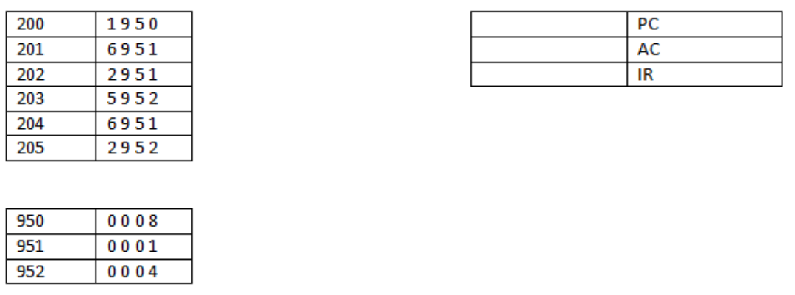

# Arquitetura e Organização de Computadores

- [Fórmulas de AOC](./FormulasAOC): Fórmulas da disciplina utilizada ao decorrer da disciplina (Speedup, CPI, MIPS, BIPS, SDRAM, etc.)
- [Conversões Dados](./ConversoesDados): Códigos de conversões de dados (bytes, bits, megabytes, kibibytes, tebibits, gigabits, etc.)
- [Execução em Baixo Nível](./TopLevel): Conversão para Java de pequenos exercícios desenvolvidos em aula que consistiam da numeração e valor da ação de comando e da memória e dados do comando mais recente e do valor atual armazenado no registrador
 
- [Sistemas Númericos](./SistemasNumericos): Conversões e Operações de Sistemas Numéricos (Decimal, Binário, Octal e Hexadecimal) e uso de conversão de binários para carácteres ASCII
- [Assembly](./Assembly): Códigos desenvolvidos em Assembly

