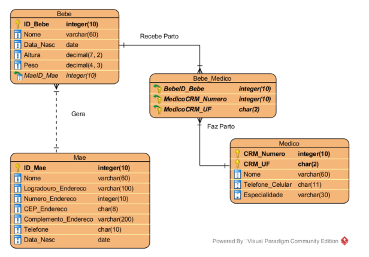

# SQL Constraints

## SQLConstraintsCheck.sql

Criar, em SQL Server, considerando o domínio de uma livraria, conforme modelado:

Foram delimitadas as seguintes restrições:
- O código do livro é auto incremental partindo de 100001 e incrementando de 100 em 100
- O código do autor é auto incremental partindo de 2351 e incrementando de 1 em 1
- O código da editora é auto incremental partindo de 491 e incrementando de 16 em 16
- Por lei, o ISBN deve ter 13 dígitos
- O nome do autor é único
- O nome da editora é único
- Se não preenchida, a língua dos livros é ‘PT-BR’
- Não são cadastrados livros de ano inferior a 1990
- Não são cadastrados livros de edição inferior a 1993
- Não existem preços negativos
- Não existem livros com menos de 15 páginas
- Não existem Números de Endereços negativos
- Telefones são fixos devem ter 10 dígitos
- No Brasil, todo CEP tem 8 caracteres
- Só são cadastrados livros de autores do Brasil, Estados Unidos, Inglaterra e Alemanha

## SQLConstraintsMaternidade.sql

Criar, em SQL Server, considerando o domínio de uma Maternidade

Foram delimitadas as seguintes restrições:
- Para a tabela mãe:
  - O ID é auto incremental, iniciando em 1001 e indo de 1 em 1
  - Número de porta não pode ser negativo
  - CEP deve ter 8 dígitos
  - Telefone deve ter 10 dígitos
- Para a tabela medico:
  - Celular deve ter 11 dígitos
  - Celular não pode repetir
- Para a tabela bebe:
  - O ID é auto incremental, iniciando em 1 e indo de 1 em 1
  - Se não preenchida, a data de nascimento é o dia de hoje
  - Altura não pode ser negativa
  - Peso não pode ser negativo

## SQLConstraintsMecanica.sql

Criar, em SQL Server, considerando o domínio de uma mecânica, conforme modelado:

Foram delimitadas as seguintes restrições:
- O ID do cliente é auto incremental partindo de 3401 e incrementando de 15 em 15
- O ID do funcionário é auto incremental partindo de 101 e incrementando de 1 em 1
- O ID da peça é auto incremental partindo de 3411 e incrementando de 7 em 7
- O ID da categoria é auto incremental partindo de 1 e incrementando de 1 em 1
- Nenhum número de endereço é negativo
- Todos os CEP de endereços devem ter 8 dígitos
- Se não preenchida, a data do reparo deve ser a data de hoje
- A oficina só trabalha com carros de modelo superior a 1997
- A oficina só trabalha com carros de fabricação superior a 1997
- O ano do modelo deve ser igual ou 1 ano superior ao ano de fabricação
- Não existem preços, custos, tempo ou valores negativos
- Telefones podem ser fixos ou celulares, tendo 10 ou 11 dígitos
- Categorias de Habilitação devem ser A, B, C, D ou E
- Todas as peças devem ter, ao menos, 10 unidades em estoque
- No Brasil, toda placa de veículo tem 7 caracteres
- Cada peça tem nome diferente
- As categorias de funcionários são estagiário, Nível 1, Nível 2 ou Nível 3 e seguem os valores:
  - Estagiário: Mais de R$15,00 / hora
  - Nível 1: Mais de R$25,00 / hora
  - Nível 2: Mais de R$35,00 / hora
  - Nível 3: Mais de R$50,00 / hora