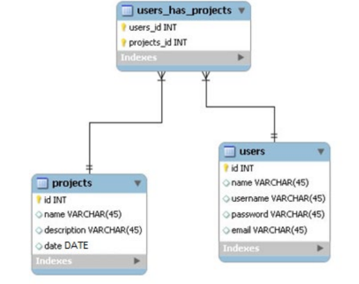
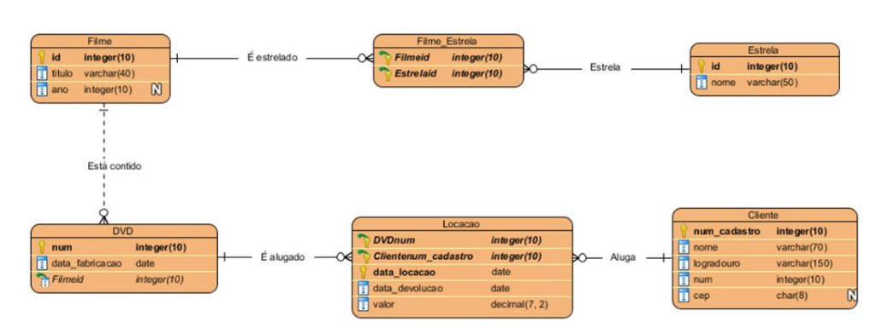

# SELECTs com Junções (INNER E OUTER JOINS)

## Projeto.sql

- Criar as tabelas da forma que foram diagramadas, obedecendo as seguintes restrições:
  - A coluna users_id da tabela associativa é FK da coluna id, tabela users
  - A coluna projects_id da tabela associativa é FK da coluna id, tabela projects
  - A coluna date da tabela projects deve verificar se a data é posterior que 01/09/2014.
  - Caso contrário, o registro não deve ser inserido
  - A PK de projects deve ser de auto incremento, iniciando em 10001, com incremento de 1
  - A PK de users deve ser de auto incremento, iniciando em 1, com incremento de 1
  - O valor padrão da coluna password da tabela users, deverá ser 123mudar
  - A coluna username da tabela users deve ter restrição de unicidade.

- Modificar a coluna username da tabela Users para varchar(10)
- Modificar a coluna password da tabela Users para varchar(8)

Inserir os dados abaixo:

### Users
| Id | Nome      | Usuário     | Senha     | Email                |
|----|-----------|-------------|-----------|----------------------|
| 1  | Maria     | Rh_maria    | 123mudar  | maria@empresa.com    |
| 2  | Paulo     | Ti_paulo    | 123@456   | paulo@empresa.com    |
| 3  | Ana       | Rh_ana      | 123mudar  | ana@empresa.com      |
| 4  | Clara     | Ti_clara    | 123mudar  | clara@empresa.com    |
| 5  | Aparecido | Rh_apareci  | 55@!cido  | aparecido@empresa.com |

### Projects
| Id     | Nome             | Descrição               | Data       |
|--------|------------------|--------------------------|------------|
| 10001  | Re-folha         | Refatoração das Folhas   | 05/09/2014 |
| 10002  | Manutenção PC´s  | Manutenção PC´s          | 06/09/2014 |
| 10003  | Auditoria        | NULL                     | 07/09/2014 |

### Users_has_projects
| Users_id | Projects_id |
|----------|-------------|
| 1        | 10001       |
| 5        | 10001       |
| 3        | 10003       |
| 4        | 10002       |
| 2        | 10002       |

- Considerar as situações:
  - O projeto de Manutenção atrasou, mudar a data para 12/09/2014
  - O username de aparecido (usar o nome como condição de mudança) está feio, mudar para Rh_cido
  - Mudar o password do username Rh_maria (usar o username como condição de mudança) para 888@*, mas a condição deve verificar se o password dela ainda é 123mudar
  - O user de id 2 não participa mais do projeto 10002, removê-lo da associativa

Fazer (seção nova):

a) Adicionar User (6; Joao; Ti_joao; 123mudar; joao@empresa.com)

b) Adicionar Project
(10004; Atualização de Sistemas; Modificação de Sistemas Operacionais nos PC's; 12/09/2014)

c) Consultar:
  1) Id, Name e Email de Users, Id, Name, Description e Data de Projects, dos usuários que participaram do projeto Name Re-folha
  2) Name dos Projects que não tem Users
  3) Name dos Users que não tem Projects

## Locacao.sql

- Restrições:
  - Ano de filme deve ser menor ou igual a 2021
  - Data de fabricação de DVD deve ser menor do que hoje
  - Número do endereço de Cliente deve ser positivo
  - CEP do endereço de Cliente deve ter, especificamente, 8 caracteres
  - Data de locação de Locação, por padrão, deve ser hoje
  - Data de devolução de Locação, deve ser maior que a data de locação
  - Valor de Locação deve ser positivo

- Esquema:
  - A entidade estrela deveria ter o nome real da estrela, com 50 caracteres
  - Verificando um dos nomes de filme, percebeu-se que o nome do filme deveria ser um atributo com 80 caracteres

Considere os dados:

### Filme

| Id    | Título                                               | Ano  |
|-------|------------------------------------------------------|------|
| 1001  | Whiplash                                             | 2015 |
| 1002  | Birdman                                              | 2015 |
| 1003  | Interestelar                                         | 2014 |
| 1004  | A Culpa é das Estrelas                               | 2014 |
| 1005  | Alexandre e o Dia Terrível, Horrível, Espantoso e Horroroso | 2014 |
| 1006  | Sing                                                 | 2016 |

### Estrela
| ID   | Nome             | Nome real               |
|------|------------------|--------------------------|
| 9901 | Michael Keaton   | Michael John Douglas     |
| 9902 | Emma Stone       | Emily Jean Stone         |
| 9903 | Miles Teller     | NULL                     |
| 9904 | Steve Carell     | Steven John Carell       |
| 9905 | Jennifer Garner  | Jennifer Anne Garner     |

### Filme_Estrela
| FilmeId | EstrelaId |
|---------|-----------|
| 1002    | 9901      |
| 1002    | 9902      |
| 1001    | 9903      |
| 1005    | 9904      |
| 1005    | 9905      |

### DVD

| Num    | Data_fabricacao | FilmeId |
|--------|------------------|---------|
| 10001  | 2020-12-02       | 1001    |
| 10002  | 2019-10-18       | 1002    |
| 10003  | 2020-04-03       | 1003    |
| 10004  | 2020-12-02       | 1001    |
| 10005  | 2019-10-18       | 1004    |
| 10006  | 2020-04-03       | 1002    |
| 10007  | 2020-12-02       | 1005    |
| 10008  | 2019-10-18       | 1002    |
| 10009  | 2020-04-03       | 1003    |

### Cliente
| Num_cadastro | Nome            | Logradouro                  | Num | CEP       |
|--------------|------------------|------------------------------|-----|-----------|
| 5501         | Matilde Luz      | Rua Síria                    | 150 | 03086040  |
| 5502         | Carlos Carreiro  | Rua Bartolomeu Aires         | 1250| 04419110  |
| 5503         | Daniel Ramalho   | Rua Itajutiba                | 169 | NULL      |
| 5504         | Roberta Bento    | Rua Jayme Von Rosenburg      | 36  | NULL      |
| 5505         | Rosa Cerqueira   | Rua Arnaldo Simões Pinto     | 235 | 02917110  |

### Locação

| DVDnum | ClienteNum_Cadastro | Data_Locacao | Data_Devolucao | Valor |
|--------|----------------------|---------------|----------------|--------|
| 10001  | 5502                 | 2021-02-18    | 2021-02-21     | 3.50   |
| 10009  | 5502                 | 2021-02-18    | 2021-02-21     | 3.50   |
| 10002  | 5503                 | 2021-02-18    | 2021-02-19     | 3.50   |
| 10002  | 5505                 | 2021-02-20    | 2021-02-23     | 3.00   |
| 10004  | 5505                 | 2021-02-20    | 2021-02-23     | 3.00   |
| 10005  | 5505                 | 2021-02-20    | 2021-02-23     | 3.00   |
| 10001  | 5501                 | 2021-02-24    | 2021-02-26     | 3.50   |
| 10008  | 5501                 | 2021-02-24    | 2021-02-26     | 3.50   |

- Operações com dados:
  - Os CEP dos clientes 5503 e 5504 são 08411150 e 02918190 respectivamente
  - A locação de 2021-02-18 do cliente 5502 teve o valor de 3.25 para cada DVD alugado
  - A locação de 2021-02-24 do cliente 5501 teve o valor de 3.10 para cada DVD alugado
  - O DVD 10005 foi fabricado em 2019-07-14
  - O nome real de Miles Teller é Miles Alexander Teller
  - O filme Sing não tem DVD cadastrado e deve ser excluído

Consultar (seção nova):

<b> Não esquecer de rever as restrições de datas </b>

  1) Consultar num_cadastro do cliente, nome do cliente, data_locacao (Formato dd/mm/aaaa), Qtd_dias_alugado (total de dias que o filme ficou alugado), titulo do filme, ano do filme da locação do cliente cujo nome inicia com Matilde
  2) Consultar nome da estrela, nome_real da estrela, título do filme dos filmes cadastrados do ano de 2015
  3) Consultar título do filme, data_fabricação do dvd (formato dd/mm/aaaa), caso a diferença do ano do filme com o ano atual seja maior que 6, deve aparecer a diferença do ano com o ano atual concatenado com a palavra anos (Exemplo: 7 anos), caso contrário só a diferença (Exemplo: 4).