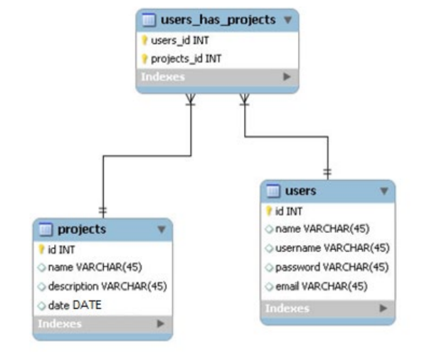
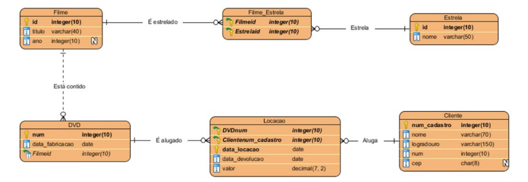

# Subqueries e Selects Cases

- PK = Campo com chave primária (Primary Key)
- FK = Campo com chave estrangeira (Foreign Key)

## Projeto.sql

Considere o diagrama abaixo:

- Criar as tabelas da forma que foram diagramadas, obedecendo as seguintes restrições:
  - A coluna users_id da tabela associativa é FK da coluna id, tabela users
  - A coluna projects_id da tabela associativa é FK da coluna id, tabela projects
  - A coluna date da tabela projects deve verificar se a data é posterior que 01/09/2014.
  - Caso contrário, o registro não deve ser inserido
  - A PK de projects deve ser de auto incremento, iniciando em 10001, com incremento de 1
  - A PK de users deve ser de auto incremento, iniciando em 1, com incremento de 1
  - O valor padrão da coluna password da tabela users, deverá ser 123mudar
  - A coluna username da tabela users deve ter restrição de unicidade.

- Modificar a coluna username da tabela Users para varchar(10)
- Modificar a coluna password da tabela Users para varchar(8)

Inserir os dados abaixo:

### Users
| Id | Nome      | Usuário     | Senha     | Email                |
|----|-----------|-------------|-----------|----------------------|
| 1  | Maria     | Rh_maria    | 123mudar  | maria@empresa.com    |
| 2  | Paulo     | Ti_paulo    | 123@456   | paulo@empresa.com    |
| 3  | Ana       | Rh_ana      | 123mudar  | ana@empresa.com      |
| 4  | Clara     | Ti_clara    | 123mudar  | clara@empresa.com    |
| 5  | Aparecido | Rh_apareci  | 55@!cido  | aparecido@empresa.com |

### Projects
| Id     | Nome             | Descrição               | Data       |
|--------|------------------|--------------------------|------------|
| 10001  | Re-folha         | Refatoração das Folhas   | 05/09/2014 |
| 10002  | Manutenção PC´s  | Manutenção PC´s          | 06/09/2014 |
| 10003  | Auditoria        | NULL                     | 07/09/2014 |

### Users_has_projects
| Users_id | Projects_id |
|----------|-------------|
| 1        | 10001       |
| 5        | 10001       |
| 3        | 10003       |
| 4        | 10002       |
| 2        | 10002       |

Considerar as situações:
- O projeto de Manutenção atrasou, mudar a data para 12/09/2014
- O username de aparecido (usar o nome como condição de mudança) está feio, mudar para
Rh_cido
- Mudar o password do username Rh_maria (usar o username como condição de mudança)
para 888@*, mas a condição deve verificar se o password dela ainda é 123mudar
- O user de id 2 não participa mais do projeto 10002, removê-lo da associativa

- Consultar (seção nova):
  - Fazer uma consulta que retorne id, nome, email, username e caso a senha seja diferente de 123mudar, mostrar ******** (8 asteriscos), caso contrário, mostrar a própria senha.
  - Considerando que o projeto 10001 durou 15 dias, fazer uma consulta que mostre o nome do projeto, descrição, data, data_final do projeto realizado por usuário de e-mail aparecido@empresa.com
  - Fazer uma consulta que retorne o nome e o email dos usuários que estão envolvidos no projeto de nome Auditoria
  - Considerando que o custo diário do projeto, cujo nome tem o termo Manutenção, é de 79.85 e ele deve finalizar 16/09/2014, consultar, nome, descrição, data, data_final e custo_total do projeto

## Locacao.sql

- Restrições:
  - Ano de filme deve ser menor ou igual a 2021
  - Data de fabricação de DVD deve ser menor do que hoje
  - Número do endereço de Cliente deve ser positivo
  - CEP do endereço de Cliente deve ter, especificamente, 8 caracteres
  - Data de locação de Locação, por padrão, deve ser hoje
  - Data de devolução de Locação, deve ser maior que a data de locação
  - Valor de Locação deve ser positivo

- Esquema:
  - A entidade estrela deveria ter o nome real da estrela, com 50 caracteres
  - Verificando um dos nomes de filme, percebeu-se que o nome do filme deveria ser um atributo com 80 caracteres

Considere os dados:

### Filme

| Id    | Título                                               | Ano  |
|-------|------------------------------------------------------|------|
| 1001  | Whiplash                                             | 2015 |
| 1002  | Birdman                                              | 2015 |
| 1003  | Interestelar                                         | 2014 |
| 1004  | A Culpa é das Estrelas                               | 2014 |
| 1005  | Alexandre e o Dia Terrível, Horrível, Espantoso e Horroroso | 2014 |
| 1006  | Sing                                                 | 2016 |

### Estrela
| ID   | Nome             | Nome real               |
|------|------------------|--------------------------|
| 9901 | Michael Keaton   | Michael John Douglas     |
| 9902 | Emma Stone       | Emily Jean Stone         |
| 9903 | Miles Teller     | NULL                     |
| 9904 | Steve Carell     | Steven John Carell       |
| 9905 | Jennifer Garner  | Jennifer Anne Garner     |

### Filme_Estrela
| FilmeId | EstrelaId |
|---------|-----------|
| 1002    | 9901      |
| 1002    | 9902      |
| 1001    | 9903      |
| 1005    | 9904      |
| 1005    | 9905      |

### DVD

| Num    | Data_fabricacao | FilmeId |
|--------|------------------|---------|
| 10001  | 2020-12-02       | 1001    |
| 10002  | 2019-10-18       | 1002    |
| 10003  | 2020-04-03       | 1003    |
| 10004  | 2020-12-02       | 1001    |
| 10005  | 2019-10-18       | 1004    |
| 10006  | 2020-04-03       | 1002    |
| 10007  | 2020-12-02       | 1005    |
| 10008  | 2019-10-18       | 1002    |
| 10009  | 2020-04-03       | 1003    |

### Cliente
| Num_cadastro | Nome            | Logradouro                  | Num | CEP       |
|--------------|------------------|------------------------------|-----|-----------|
| 5501         | Matilde Luz      | Rua Síria                    | 150 | 03086040  |
| 5502         | Carlos Carreiro  | Rua Bartolomeu Aires         | 1250| 04419110  |
| 5503         | Daniel Ramalho   | Rua Itajutiba                | 169 | NULL      |
| 5504         | Roberta Bento    | Rua Jayme Von Rosenburg      | 36  | NULL      |
| 5505         | Rosa Cerqueira   | Rua Arnaldo Simões Pinto     | 235 | 02917110  |

### Locação

| DVDnum | ClienteNum_Cadastro | Data_Locacao | Data_Devolucao | Valor |
|--------|----------------------|---------------|----------------|--------|
| 10001  | 5502                 | 2021-02-18    | 2021-02-21     | 3.50   |
| 10009  | 5502                 | 2021-02-18    | 2021-02-21     | 3.50   |
| 10002  | 5503                 | 2021-02-18    | 2021-02-19     | 3.50   |
| 10002  | 5505                 | 2021-02-20    | 2021-02-23     | 3.00   |
| 10004  | 5505                 | 2021-02-20    | 2021-02-23     | 3.00   |
| 10005  | 5505                 | 2021-02-20    | 2021-02-23     | 3.00   |
| 10001  | 5501                 | 2021-02-24    | 2021-02-26     | 3.50   |
| 10008  | 5501                 | 2021-02-24    | 2021-02-26     | 3.50   |

- Operações com dados:
  - Os CEP dos clientes 5503 e 5504 são 08411150 e 02918190 respectivamente
  - A locação de 2021-02-18 do cliente 5502 teve o valor de 3.25 para cada DVD alugado
  - A locação de 2021-02-24 do cliente 5501 teve o valor de 3.10 para cada DVD alugado
  - O DVD 10005 foi fabricado em 2019-07-14
  - O nome real de Miles Teller é Miles Alexander Teller
  - O filme Sing não tem DVD cadastrado e deve ser excluído

- Consultar (seção nova): 
  1) Fazer uma consulta que retorne ID, Ano, nome do Filme (Caso o nome do filme tenha mais de 10 caracteres, para caber no campo da tela, mostrar os 10 primeiros caracteres, seguidos de reticências ...) dos filmes cujos DVDs foram fabricados depois de 01/01/2020
  2) Fazer uma consulta que retorne num, data_fabricacao, qtd_meses_desde_fabricacao (Quantos meses desde que o dvd foi fabricado até hoje) do filme Interestelar
  3) Fazer uma consulta que retorne num_dvd, data_locacao, data_devolucao, dias_alugado(Total de dias que o dvd ficou alugado) e valor das locações da cliente que tem, no nome, o termo Rosa
  4) Nome, endereço_completo (logradouro e número concatenados), cep (formato XXXXX-XXX) dos clientes que alugaram DVD de num 10002.
