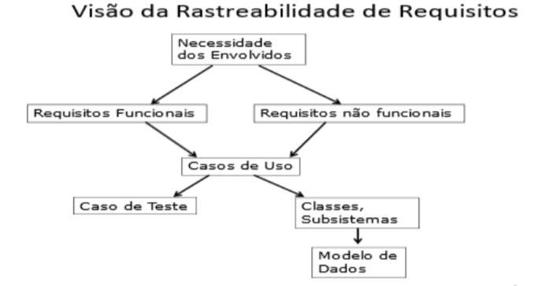

# Engenharia de Software I

## [Sistema de Controle de Hotelaria](./Hotelaria/)

- Os quartos podem ser alugados quando o hóspede chega ao hotel (desde que existam vagas) ou sejam reservados via internet. Caso seja a primeira vez que o hóspede aluga quartos ou seus dados tenham sofrido alterações, o hóspede deve ser cadastrado antes de finalizar o aluguel do quarto. 
- Além do aluguel do quarto, o hotel oferece diversos serviços como restaurante, lavar e/ou passar roupas. 
- Obviamente, qualquer desses serviços, se solicitado, será cobrado na fatura final. 
- O hóspede pode também consumir os produtos contidos no frigobar, que também são cobrados pelo hotel. As diárias vencem ao meio-dia. A política do hotel exige que as diárias sejam quitadas semanalmente. 
- Quando o cliente for quitar a fatura, quitará não somente as diárias do(s) quarto(s) que alugou, mas também qualquer serviço que tenha solicitado e os itens consumidos no frigobar.

## [Sistema de Controle de Medicação](./Medicacao/)

- As informações a seguir se referem a uma aplicação de controle pessoal de horário de remédios, aplicativo que o Maurício pretende utilizar no seu Smartphone. 
- Para cada remédio cadastra-se o nome de quem vai tomar o remédio, a data de início, a quantidade de dias que foi prescrita pelo médico, a quantidade de vezes ao dia, a dosagem e o nome do remédio. Ao cadastrar a medicação, a aplicação deverá sugerir todos os horários possíveis para tomar o remédio. 
- O usuário escolhe o melhor horário e a aplicação avisa até quando o remédio deve ser tomado e prepara uma planilha de horários. 
- O aplicativo deverá emitir um alarme sonoro 15 minutos antes do horário da medicação ser tomada e após ingestão da medição o usuário deverá confirmar que tomou o remédio.

## [Buffet](./Buffet/)

- Rafaela possui vários temas de festas infantis para aluguel. 
- Ela precisa controlar os aluguéis e para isso quer uma aplicação que permita cadastrar: o nome e o telefone do cliente, o endereço completo da festa, o tema escolhido, a data da festa, a hora de início e término da festa. 
- Além disso, para alguns clientes antigos, Rafaela oferece descontos. Sendo assim, é preciso saber o valor realmente cobrado num determinado aluguel.

## [Clube Cultural](./Clube/)

- Ian tem uma coleção grande de revistas em quadrinhos. Por isso, resolveu emprestar para os amigos. Assim foi criado o Clube da Leitura. 
- Mas para não perder nenhuma revista, seu pai lhe fez uma aplicação que cadastra as revistas e controla o empréstimo. 
- Para cada revista cadastram-se: o tipo da coleção (por exemplo: Cebolinha, Pato Donald, Batman etc.), o número da edição, o ano da revista e a caixa onde está guardada. Cada caixa tem uma cor, uma etiqueta e um número. 
- Para cada empréstimo cadastram-se: o amiguinho que pegou a revista, qual foi a revista, a data de empréstimo e a data de devolução. 
- Cada criança só pode pegar uma revista por empréstimo. O cadastro do amiguinho consiste de: o nome do amiguinho, o nome da mãe, o telefone e de onde é o amigo (do prédio ou da escola).

## [Padaria Doce Sabor](./Padaria/)

- As informações a seguir se referem a uma aplicação de controle de comanda eletrônica da padaria Doce Sabor do Seu Joaquim. 
- O cliente usa uma comanda eletrônica durante suas compras na Padaria. A cada produto consumido, o atendente registra em sua comanda (que possui uma numeração) o produto e a quantidade. 
- Ao passar no caixa na saída da Padaria, a Caixa lê os gastos da comanda, finalizando a compra. 
- Na leitura da comanda, verifica-se o valor unitário de cada produto a fim de calcular o valor total da compra.

## [Controle de Fila de Espera](./ControleFila/)

- A empresa Compre Bem implantou uma senha de atendimento para o SAC (Serviço de atendimento ao consumidor) nas suas lojas. 
- O objetivo é reduzir o tempo de espera na fila. O atendimento é dividido por assuntos e cada caixa pode cuidar de um ou mais assuntos, ou um assunto pode ser tratado por um ou mais caixas. 
- Para cada caixa deve-se saber o número e a posição (quantos atendimentos ainda faltam para chegar à sua vez). 
- Para cada caixa, deve-se ter um histórico de atendimentos, para se obter estatística. 
- A estatística deve ser detalhada quanto ao tempo mínimo, médio e máximo de atendimento por caixa e por dia, além do número de atendimentos por assunto. 
- A qualquer momento é preciso saber a quantidade de atendimentos efetuados em um determinado caixa.