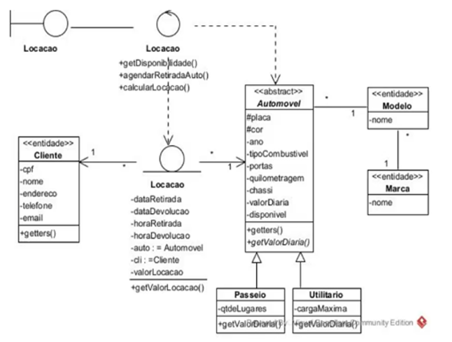
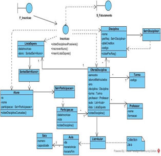
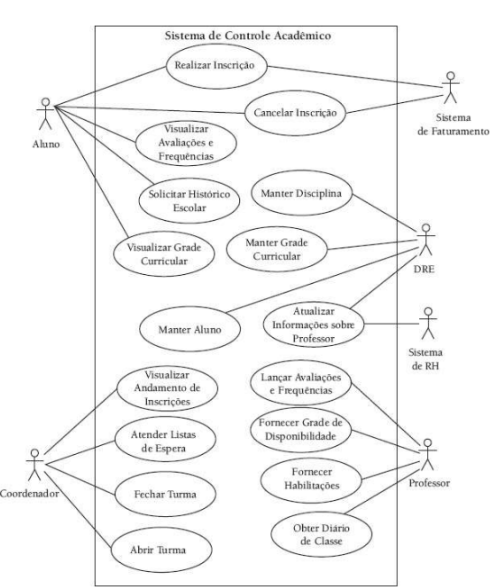

# Engenharia de Software III

## [Locação de Veículos](./LocacaoAutomovel/)

A empresa tem muitos automóveis. Cada automóvel tem características como número da placa, cor, ano, tipo de combustível, número de portas, quilometragem, chassi e valor de localização. Cada automóvel tem um modelo e uma marca, mas um modelo pode se relacionar a muitos carros e uma marca pode se relacionar a muitos modelos, embora cada modelo só tenha uma marca específica. Um carro pode ser alugado por muitos clientes, em momentos diferentes e um cliente pode alugar muitos carros. É preciso saber quais carros estão localizados ou não. Sempre que um carro for alugado é preciso armazenar os dados e a hora de sua localização e, quando for alugar, os dados e a hora de devolução. Cada cliente tem características como CPF, nome, endereço, telefone e e-mail.

## [SCA](./SCA/)

A partir desta seção, um estudo de caso começa a ser desenvolvido. Esse estudo tem o objetivo de consolidar os princípios teóricos descritos e oferecer uma visão prática sobre como os modelos apresentados neste livro são desenvolvidos. Batizamos o sistema de nosso estudo de caso com o nome de Sistema de Controle Acadêmico (SCA).

O desenvolvimento de nosso estudo de caso é feito de forma incremental: em cada capítulo deste livro em que haja uma seção denominada "Estudo de caso", uma parte do desenvolvimento é apresentada. É importante notar que, para manter a descrição em um nível de simplicidade e clareza aceitável para um livro didático, muitos detalhes do desenvolvimento são ignorados.

O estudo de caso constitui-se de uma instituição de ensino que precisa de uma aplicação para controlar alguns processos acadêmicos, como inscrições em disciplinas, liberação de notas, alocação de recursos para turmas, etc. Após o levantamento de requisitos iniciais desse sistema, os analistas chegaram à seguinte lista de requisitos relevantes:

| Código | Requisito                                                                                                                                         |
|--------|---------------------------------------------------------------------------------------------------------------------------------------------------|
| R1     | O sistema deve permitir que os alunos visualizem as notas obtidas por semestre letivo.                                                           |
| R2     | O sistema deve permitir o lançamento das notas das disciplinas lecionadas em um semestre letivo e controlar os prazos e atrasos neste lançamento.|
| R3     | O sistema deve manter informações cadastrais sobre disciplinas no currículo escolar.                                                              |
| R4     | O sistema deve permitir a abertura de turmas para uma disciplina, assim como definição de salas, laboratórios, horários e dias de aula.          |
| R5     | O sistema deve permitir que os alunos realizem a inscrição em disciplinas de um semestre letivo.                                                 |
| R6     | O sistema deve permitir o controle do andamento das inscrições em disciplinas feitas pelos alunos.                                               |
| R7     | O sistema deve se comunicar com o Sistema de Recursos Humanos para obter dados cadastrais dos professores.                                       |
| R8     | O sistema deve se comunicar com o Sistema de Faturamento para informar as inscrições realizadas pelos alunos.                                    |
| R9     | O sistema deve manter informações cadastrais dos alunos e de seus históricos escolares.                                                           |

Algumas regras iniciais do negócio também foram identificadas para o sistema. Essas regras são descritas a seguir:

| Regra de Negócio  | Descrição                                                                                                                                |
|---------|--------------------------------------------------------------------------------------------------------------------------------------------------|
| RN00    | Em um semestre letivo, um aluno não pode se inscrever em turmas de disciplinas para as quais haja choque de horários.                           |
| RN01    | Em um semestre letivo, um aluno não pode se inscrever em turmas cuja soma de créditos ultrapasse vinte.                                         |
| RN02    | Uma turma não pode ter mais alunos inscritos do que a capacidade máxima definida.                                                               |
| RN03    | Um aluno só pode se inscrever em disciplinas para as quais possua os pré-requisitos e não tenha sido aprovado anteriormente.                    |
| RN04    | Um professor só pode lecionar disciplinas para as quais esteja habilitado.                                                                      |
| RN05    | Um aluno deve ter a matrícula cancelada por reprovação mais de duas vezes na mesma disciplina (por média ou faltas).                            |
| RN06    | Avaliação: NP é a média de A1 e A2. Se NP ≥ 7, MF = NP → aprovado. Se NP < 3, MF = NP → reprovado. NP entre 5 e 7 exige exame final (NF). MF = média entre NP e NF. MF ≥ 5 → aprovado. Caso contrário → reprovado. Frequência < 75% → reprovado por faltas. |
| RN07    | Em lista de espera, alunos mais antigos têm prioridade ao serem alocados em nova turma.                                                         |

Nesse sistema de controle acadêmico, o analista recusou e documentou os seguintes participantes:

- Aluno: indivíduo que está matriculado na instituição de ensino com interesse em se inscrever em turmas de disciplinas do curso.

- Professor: indivíduo que leciona disciplinas na faculdade.

- Coordenador: pessoa responsável por agendar as alocações de turmas e professores e visualizar o andamento das inscrições dos alunos.

- Departamento de Registro Escolar (DRE): departamento da faculdade interessado em manter informações sobre os alunos matriculados e sobre seu histórico escolar.

- Sistema de Recursos Humanos: este sistema substitui é responsável por fornecer informações cadastrais sobre os professores.

- Sistema de Faturamento: este sistema substitui tem interesse em obter informações sobre inscrições dos alunos para realizar o controle de pagamento de mensalidades.

- O analista também recusou os casos de uso a seguir e os organizou em três pacotes: 
  - Gerenciamento de Inscrições
  - Gerenciamento de Recursos Acadêmicos 
  - Acompanhamento de Semestre Letivo
- Os casos de uso que apresentam comentários (entre pais e em itálico) são aqueles para os quais não fornecem descrições explicativas

Casos de Uso
- Gerenciamento de Inscrições
  - Realizar Inscrição
  - Cancelar Inscrição
  - Visualizar Grade Curricular (O aluno visualiza a grade curricular atual)
  - Visualizar Andamento de Inscrições
  - Abrir Turma
  - Fechar Turma
  - Atender Listas de Espera
- Gerenciamento de Recursos Acadêmicos
  - Manter Grade Curricular
  - Manter Disciplina
  - Manter Aluno (DRE mantém informações sobre o aluno)
  - Provedor de Grade de Disponibilidade
  - Provedor de Habilitações
  - Atualizar Informações sobre Professor
- Acompanhamento de Semestre Letivo
  - Lançar Avaliações
  - Obter Diário de Aula
  - Visualizar Avaliações
  -  Solicitar Histórico Escolar

<strong> Fonte da atividade: Princípios de Análise e Projeto de Sistenas com UML - 3ª Edição (Eduardo Bezerra) </strong>

## Ecommerce de Livraria

Com base nos Atores, Regras de Negócio e Casos de Uso presentes neste documento, realize os exercícios de Análise e Design de Software para uma Aplicação Web de E-commerce de Livraria.

- Atores:
  - Cliente: esse ator representa os usuários externos interessados na compra de livros;
  - Funcionário: esse ator representa os usuários internos responsáveis pela manutenção dos dados dos livros, incluindo o controle da quantidade de exemplares em estoque;
  - Sistema de Frete: esse ator representa um sistema/componente externo a ser integrado com a aplicação de software da livraria para calcular o frete a ser pago;
  - Sistema de Cartão: esse ator representa um sistema/componente externo a ser integrado com a aplicação de software da livraria para possibilitar o pagamento por meio de cartão de crédito;
  - Sistema de Banco: esse ator representa um sistema/componente externo a ser integrado com a aplicação de software da livraria para possibilitar o pagamento via Pix;
  - Se necessário, outros atores, inclusive sistemas externos, podem ser identificados.
- Regras de Negócio:
  - RN01: O livro pode apresentar um dos seguintes status em um determinado tempo: disponível, indisponível ou em processo de compra;
  - RN02: Há três formatos de livro: 
    - a) físico capa dura; 
    - b) físico brochura; 
    - c) digital 
    - sendo que o preço de cada tipo de livro deve ser calculado de forma diferente, melhor dizendo, sem desconto, 5% e 10%, respectivamente;
  - RN03: Para livros em circulação, o estoque mínimo não pode ser menor do que 2 exemplares. Uma vez que o estoque atinja essa quantidade, um funcionário deve ser notificado via mensagem;
  - RN04: O pagamento pode ser realizado por meio de cartão de crédito ou Pix. O pagamento por cartão de crédito pode ser parcelado em até 3 vezes sem juros, porém, se for pago à vista, deve aplicar 3% de desconto no valor total do pedido. O pagamento via Pix, por sua vez, deve ser efetuado à vista e aplicar 8% de desconto no valor total do pedido;
  - RN05: O pedido deve apresentar um dos seguintes status em um determinado tempo: em processamento, pagamento pendente, confirmado, em transporte ou finalizado; • Se preciso, novas regras de negócio podem ser identificadas.
- Casos de Uso:
  - CSU01: Pesquisar Livro: este caso de uso representa o processo pelo qual um cliente pode pesquisar livros por título, autor, editora ou categoria. Após selecionar uma forma de pesquisa e informar os parâmetros da pesquisa, o sistema deve exibir uma listagem referente a todos os livros que satisfaçam as condições de busca, contendo o título, autor, editora, categoria, status e preço, além de permitir visualizar os detalhes do livro e adicioná-lo ao carrinho de compras. Se o cliente optar por visualizar os detalhes de um dos livros listados, uma nova página será exibida, apresentando um resumo do livro, seu formato, número de páginas e o ano de publicação. Havendo interesse por algum dos livros apresentados, o cliente pode adicionar o livro ao carrinho de compras, desse modo, uma nova página será exibida, solicitando a confirmação da quantidade de volumes que deseja comprar (o padrão é 1). Cabe frisar que tanto o caso de uso “Exibir Detalhes” quanto o caso de uso “Adicionar ao Carrinho” são extensões do caso de uso de que se trata.
  - CSU02: Efetuar Pedido: este caso de uso é referente ao processo de confirmação do pedido. Na primeira etapa, o cliente confirma o pedido (deve haver minimamente um item adicionado ao carrinho), e a página de visualização do carrinho será exibida, assim sendo, o cliente visualiza os livros selecionados e suas respectivas quantidades. Se o cliente ainda não estiver cadastrado no sistema, será preciso antes fazer o cadastro, informando seus dados pessoais. Na segunda etapa, uma vez autenticado pelo sistema, o cliente deve informar o endereço de entrega para o frete ser calculado, e em seguida selecionar a forma de pagamento, podendo ser por meio de cartão de crédito ou Pix. Após isto, o cliente deve finalizar o pedido e a quantidade de livros em estoque deve ser atualizada. Assim que o pedido for finalizado, os itens do carrinho devem ser destruídos. Cabe frisar que os casos de uso “Atualizar Estoque”, “Visualizar Carrinho”, “Calcular Frete” e “Efetuar Pagamento” são inclusões do caso de uso de que se trata e que “Pagar via Cartão” e “Pagar via Pix” são  especializações do caso de uso “Efetuar Pagamento”.
  - CSU03: Manter Cliente: este caso de uso representa a manutenção dos dados pessoais do cliente. Esse cadastro deve incluir o nome completo, CPF, data de nascimento, e-mail, telefone, endereço (um ou mais). Uma vez que o cliente ainda não possua cadastro no sistema ou seus dados tenham sofrido alguma alteração desde a última compra, é necessário registrar ou alterar seu cadastro. Cabe frisar que o caso de uso em questão é também é uma extensão do caso de uso “Efetuar Pedido”.
  - CSU04: Visualizar Pedido: este caso de uso se refere ao processo pelo qual um cliente pode acompanhar o pedido recente, assim como, visualizar o histórico de compras. Neste caso, os usuários podem tanto consultar pedidos anteriores quanto o status do pedido atual. Para realizar esse caso de uso, é necessário o cliente estar autenticado pelo sistema.
  - CSU05: Manter Livro: este caso de uso se refere à manutenção dos dados do livro. Esse cadastro deve incluir o título, ISBN, número de páginas, ano de publicação, categoria (uma ou mais), formato do livro, status, preço de venda e um pequeno resumo, além da quantidade de exemplares em estoque e informações do autor (nome, data de nascimento e nacionalidade) e da editora (nome, CNPJ, telefone e e-mail para contato). Os casos de uso “Manter Autor” e “Manter Editora” são extensões do caso de uso que se trata.

