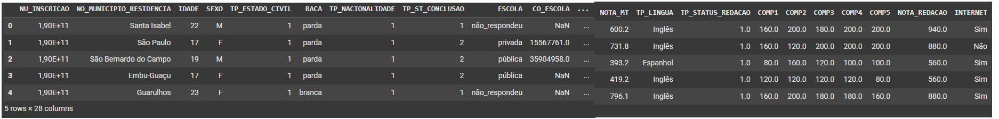
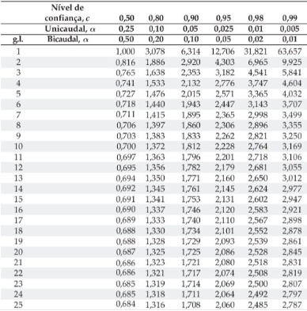
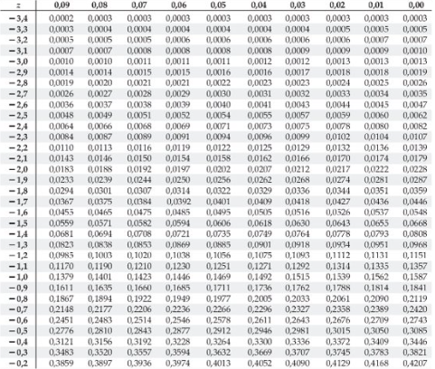
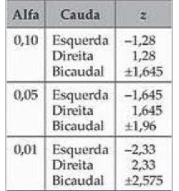
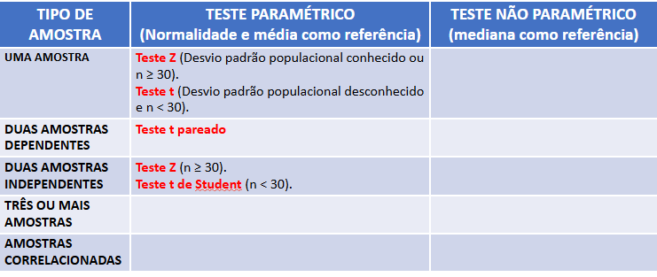
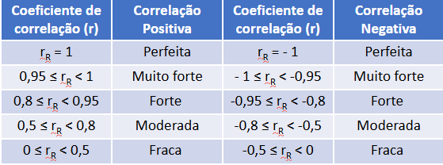
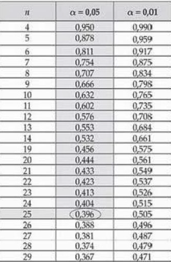

# Estatística Aplicada

- [1ª Aula](./Aula1): Classes e distâncias entre classes
- [2ª Aula](./Aula2): Tendência Central e 1ª vez usando o Google Colab e as dependências numpy e pandas para a limpeza de dados (a partir daqui todas as aulas tem um ".py" que originalmente era um ".ipynb" de lá)
- [3ª Aula](./Aula3): Medidas de Dispersão e Posição e uso dos dados tratados da 2ª aula para distribuição de frequências (em gráficos ou em resultados com uso de outras funções e módulos para isso)
- [4ª Aula](./Aula4): Probabilidade e operações, outro tratamento de dados com outros ações e funções interessantes e a Estatística Descritiva
- [5ª Aula](./Aula5): Distribuições de Probabilidades e uso de Probabilidade no Colab e Python com módulos e dataset
- [6ª Aula](./Aula5): Distribuições de Probabilidades
- [7ª Aula](./Aula7): 1º Lab
- [8ª Aula](./Aula8): Análise de Normalidade de um dataset
- [9ª Aula](./Aula9): Início dos testes da Estatística Inferencial com o teste Z e t de uma amostra. *Utiliza o "enem_2019_tratado"
- [10ª Aula](./Aula10): Teste de duas amostras dependentes e/ou independentes. *Utiliza o "enem_2019_tratado"
- [11ª Aula](./Aula11):  Teste de Mann Whitney (para verificar e testar outros fatores de Normalidade). *Utiliza o "enem_2019_tratado"
- [12ª Aula](./Aula12): Uso de tabelas e da correlação da regressão linear para possíveis previsões
- [13ª Aula](./Aula13): 2º Lab
- [Resumo 2ºBimestre](./resumo.py): Resumo desenvolvido por mim de todos os conteúdos adquiridos e coletados durante o uso do Google Colab

Nota: para os que contém a frase 'Utiliza o "enem_2019_tratado" ', existe o arquivo no diretório que foi compactado devido ao seu tamanho. Dessa forma, aqui está uma pequena percepção dele e de suas colunas/dados:

Da Nona até a Décima Segunda aula, nos conteúdos de Estatistica Inferencial, existem uso de arquivos de textos/dicionários e outros itens para se semelharem com as tabelas abaixo (em códigos Python sem ter sido feito nos labs e com o Colab, somente utilizando no geral a biblioteca math):

Teste T (padrão e pareado)

Validação pelo Valor de P

Teste Z

Escolha do Teste adequado

Verificações do Coeficiente de Correlação

