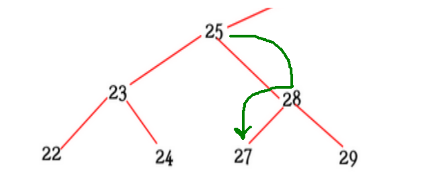
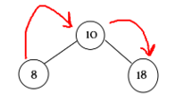
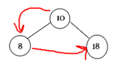
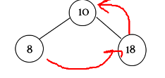
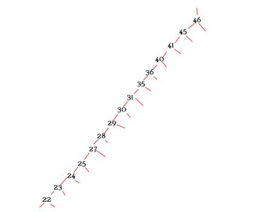

# Árvore Binária
Dentro de uma árvore binária, existe um ponto em específico que define se ela será muito boa para verificar e percorrer dados de uma forma bem mais otimizada e rápida, que é o balanceamento (que especialmente evita que ela possa se parecer com uma lista dependendo da sequência de elementos que forem adicionados)
- [Árvore Binária sem Balanceamento](./SemBalanceamento): Possuí funcionalidades mais simples, como adicionar um novo nó na árvore (com a lógica de pecorrer ela até encontrar a posição de maior/menor em um elemento é folha e adicionar o pedido como seu filho, a remoção de um elemento (que tem diversos fatores envolvidos já que não é só remover.

- Existe uma espécie de reordenação caso o elemento tenha filhos) e a impressão de ordenação de lista simples da árvore (a ordem, pré-ordem e pós-ordem)

- [Árvore Binária com Balanceamento](./ComBalanceamento): Sendo uma árvore mais justa e uma estrutura de dados que realmente possa ser utilizada em um sistema ou empresa, ela contém balanceamento (ou seja, é uma Árvore AVL ou um tipo de árvore binária de busca que possui a propriedade de autobalanceamento dinâmico). Assim, não importa a sequência que colocarmos os dados, ela reajustará a árvore a cada novo No, mantendo ela minimamente proporcional em níveis dos dois lados (no maior/direito e menor/esquerdo)
- Na primeira imagem abaixo é possível ver como ficaria uma árvore binária com um certo input específico, e por último, o quanto que ela ficaria organizada de uma forma melhor com o balanceamento

