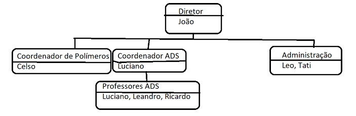

# Árvore
É uma estrutura de dados em que cada pode ter vários filhos e uma raiz principal (o primeiro elemento)
- [Árvore Binária](./Binaria): No caso de uma binária, ela pode ter no máximo dois filhos (sendo um à esquerda ou menor e outro à direito ou maior que o elemento pai)

- [Árvore não Binária](./Organograma): Para uma não binária (o exemplo do Organograma), não existe um limite exato de quantos filhos essa árvore pode ter ou não, podendo uma ter 2, outra 3 e assim por diante
  - Atividade do Organograma: O objetivo desta prática é criar um organograma de uma unidade de ensino fictícia, trata-se de um árvore não binária, e cada item da árvore é um grupo/departamento. Dentro de cada grupo/departamento temos uma lista de funcionários e esta lista é ordenada.
  - Então temos que ter uma função que cria um departamento/grupo e vamos exigir um nome, tipo: Administração, Coordenador ADS, etc. Se o pai no nó for NULL então estamos falando da raiz, só pode ser 1 nó raiz, se o segundo tentar ser adicionado eleva um exception. Para adicionar uma pessoa deve-se informar o nome do departamento/grupo e o nome da pessoa. Já para remover, deve-se também informar o nome do departamento/grupo e o nome da pessoa. Em caso de informar um departamento/grupo que não existe, eleve um exception.
  - Para pesquisar, basta passar o nome de uma pessoa, e então o sistema deverá informar o departamento/grupo que aparece aquele nome, no exemplo acima, se pesquisar Luciano deve aparecer:
    - Luciano: Coordenador ADS, Professores ADS

