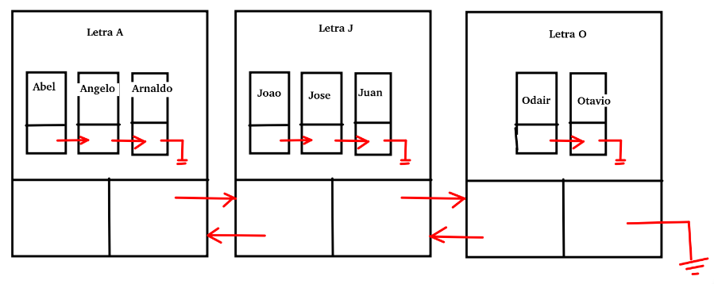

# Lista Dupla Simples (lista letras e nomes)

Para exercitar, vamos criar uma estrutura de dados diferente, trata-se de uma lista duplamente encadeada no qual possui um Nó que possui uma lista encadeada simples. Uma lista simples e uma lista dupla, como seria? Vamos exemplificar.

Ao adicionar José, a ferramenta tem que achar na Lista Dupla o nó referente a letra J e então adicionar José na lista encadeada simples, ambas as listas devem estar ordenadas, e a medida que se adiciona já se adiciona de forma ordenada.

Ao se procurar por José então deve-se achar o nó referente a letra J e em seguida procurar pela pessoa dentro da lista simples, interna ao nó.

Para remover, basta eliminar as referências de José na lista simples e se nenhum nome constar na lista simples, o nó da lista dupla deve ser removido também.

Crie então, precisará no mínimo de:
- Adicionar pessoa;
- Localizar pessoa;
- Remover pessoa.

O resto é sua lógica e sua criatividade.
