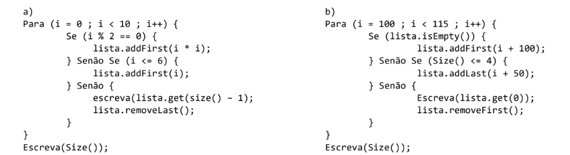
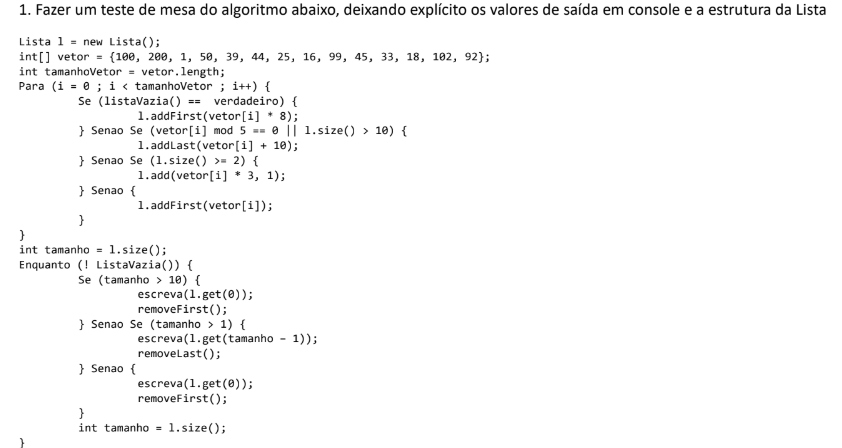
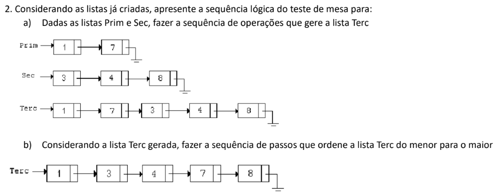
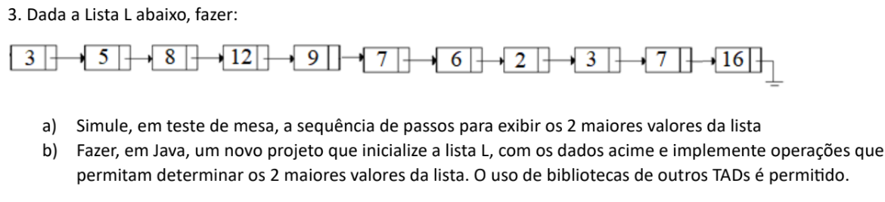
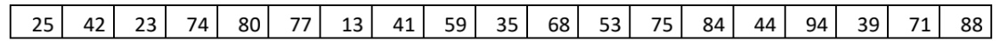
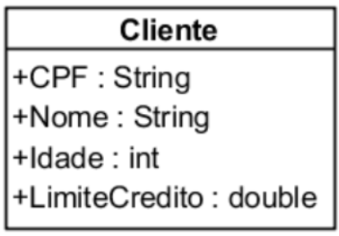
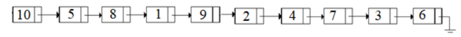
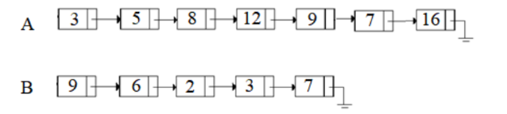
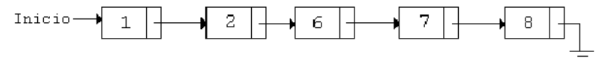
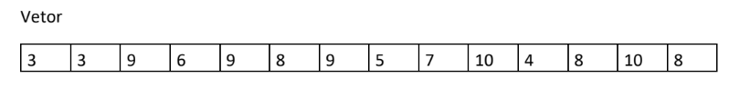

[Lista 1](./lista1):

1. Simular o comportamento de listas dinâmicas para os algoritmos abaixo (A simulação deve deixar
evidente a Lista que sobrou na memória):

2. Em Java:

   - Ajustar o projeto de aula para criar uma biblioteca de Lista Genérica, gerando o JAR Lista

3. Dada a Lista L abaixo, fazer:

   - a) Determine a sequência de passos para inverter os leemntos da própria lista e fazer a exibição dos elementos

   - b) Fazer, em Java, um novo projeto qeu insira a lista L como acima e implemente operações que permite inverter os elementos da própria Lista e a exibição dos elementos
      * É permitida a utilização de TADs (Estrutura de Dados) auxiliares

[Lista 2](./lista2):

1. Fazer um teste de mesa do algoritmo abaixo, deixando explícito os valores de saída em console e a estrutura da Lista

4. Fazer o teste de mesa considerando o vetor

A partir de uma Lista L iniciada e para cada elemento do vetor:
- Se a lista estiver vazia, inserir, no início, o dobro do valor
  - Senão, se a lista tiver menos de 3 elementos, inserir, no fim, a metade do valor (Inteiro)
  - Senão, se a lista tiver mais de 10 elementos, inserir, na posição 5, o triplo do valor
  - Senão, inserir, na posição 1, o valor
Ao terminar de percorrer o vetor, fazer:
Enquanto a lista tiver elementos:
- Se a lista tiver mais de 10 elementos, remover a posição 3 e exibir
  - Senão, se a lista tiver mais de 5 elementos, remover do fim e exibir
  - Senão, se a lista tiver mais de 3 elementos, remover a posição 1 e exibir
  - Senão, remover do início e exibir

5. A Empresa XYZ quer fazer um ajuste no seu cadastro de clientes trocando o que está em um único arquivo para
diversos arquivos, a fim de facilitar a busca quando o Cliente fizer uma compra:

- 1. Criar um objeto model com os atributos:

2. Criar, manualmente, um arquivo texto chamado cadastro.csv na pasta C:\TEMP (Caso a pasta não exista, cria-la
manualmente, também)
3. Preencher os arquivos com os dados oferecidos no final do enunciado
4. Criar uma classe controller, chamada ModificacaoCadastroController:
  - Um método, private novoArquivo(Lista l, String nomeArquivo) : void, que deverá:
    - a. Inicializar um new File com o caminho “C:\\TEMP” e o nome do Arquivo passado como parâmetro
    - b. Inicializar um contador
    - c. Inicializar um StringBuffer
    - d. Percorrer a lista de Objetos
    - e. Para cada elemento da lista, criar uma String no formato csv, igual ao arquivo cadastro.csv (Não esquecendo a quebra de linha ao final da String)
    - f. Gravar o buffer no novo arquivo
- Um método, public novoCadastro(int idadeMin, int idadeMax, Double limiteCredito) : void, que deverá:
    - a. Inicializar uma lista de clientes
    - b. Percorrer o arquivo cadastro.csv
    - c. Para cada linha do arquivo, fazer uma operação de split e armazenar em um novo objeto cliente, osvalores
    - d. Verificar se a idade está entre os valores de idade passados como parâmetro(min e max) e o limite de crédito seja maior que o limite de crédito passados como parâmetro. Em caso positivo, adicionar à lista;
    - e. Chamar o método de escrita de novo arquivo, passando a lista como parâmetro e o nome do novo arquivo como parâmetros. O nome do novo arquivo deve ser: “Idade “+idade+” limite”+limiteCredito;

5) Criar uma classe view (Principal.java) que, na main:
- a. Chame o método novoCadastro da classe ModificacaoCadastroController 3 vezes:
  - i. Para idade entre 41 e 60 e limite de Crédito acima de 8000.00
  - ii. Para idade entre 31 e 40 e limite de Crédito acima de 5000.00
  - iii. Para idade entre 21 e 30 e limite de Crédito acima de 3000. 00

- Obs.: Linhas que estejam no arquivo cadastro.csv e não forem contemplados nas condições serão desconsideradas pela
empresa 

<i>Cadastro.csv (CPF, Nome, Idade,LimiteCredito) </i>

[Lista 3](./lista3):

1. Dada a Lista L abaixo, fazer:

- a. Ordenar a lista (Usar outros TADs é permitido)

- b) Implementar, em Java, um projeto que inicie a Lista L como apresentada acima e, faça sua ordenação e
exiba ordenada. Permitido usar bibliotecas de outras TADs

2. Dadas as listas A e B, faça:

- a) Criar a sequência de passos para criar a lista I e a lista U onde:
  - i. I é a lista com a intersecção das listas A e B
  - ii. U é a lista com a união de A e B
- b) Fazer, em Java, um novo projeto que inicialize as listas A e B e tenha métodos que gere e imprima as listas I e U.

3. Dada uma lista inicial L, conforme o exemplo abaixo, demonstre, com operações de lista, como ficará L ao final
das aplicações dos passos, como determinado abaixo:

Baseado no vetor abaixo e para cada posição do vetor:

- Se o valor já existe na lista, inserir no fim
  - Senão, se o valor for par, inserir na posição 2
  - Senão, se o valor for ímpar, inserir na posição 1

4. Considerando o projeto que gerou a biblioteca Lista Genérica no exercício 1, fazer uma modificação para criar a
biblioteca Set Genérica. 
- Set é uma coleção de dados semelhante a uma Lista Encadeada Simples, no entanto, os métodos de adição de um novo elemento precisam ter uma verificação extra, que consiste como segue: 
  - Um valor não pode ser inserido na lista se já houver um valor igual adicionado na lista
- Criar um novo Projeto Java Set semelhante ao projeto de Lista, aplicar a verificação de elementos iguais em todos
os métodos de adição e criar a biblioteca com o JAR Set.

5. Considerando a biblioteca Lista Genérica criada, fazer uma aplicação Java que simule uma playlist de músicas em um aplicativo gratuito. O tal aplicativo Vitufy, por ser gratuito, a partir de uma lista, só permite a execução das músicas na ordem em que forem inseridas, não permitindo avançar nem retornar. Criar um objeto Musica (String nome; String nomeArtista; int duracao)
- Criar uma classe PlayerController no Package controller, que tenha alguns métodos:

  - adicionaMusica(Lista lista,String musica):void, que receberá uma String no formato:
    - Nome_da_musica;nome_artista;duracao (obrigatoriamente dessa forma), fazer o split e gravar em um objeto Musica e, se a lista estiver vazia, adicione na primeira posição. A partir do segundo elemento, todas as outras músicas devem entrar no final da lista;
  - removeMusica(Lista lista, int posição): void, permitindo que o usuário remova qualquer música da lista. Se a lista estiver vazia, uma exceção deve ser mostrada;
  - executaPlaylist(Lista lista): void, que exibirá, do primeiro ao último elemento, no formato [Música: nome da música – Artista: nome artista – Duração: duracao]. Se a lista estiver vazia, uma exceção deverá ser lançada.

- Bônus: Gerar um sleep para simular a música tocando. Por não ser uma classe tipo Thread, deve-se usar Thread.sleep(tempo); para conseguir o mesmo efeito. No Package view, criar uma classe chamada Principal, e, na sua Main, inicialize uma Lista Encadeada e oferecer ao usuário a opção de inserir ou remover músicas na playlist e executar a playlist. No caso da inserção de músicas, deve-se pedir, ao usuário, que digite separadamente cada campo e monte uma String que será mandada ao método adicionaMusica na classe PlayerController. A aplicação deve ficar ativa até que o usuário digite uma opção de sair.