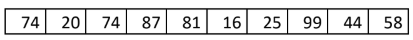
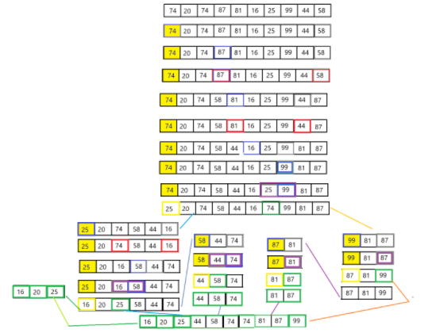
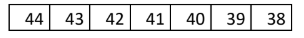
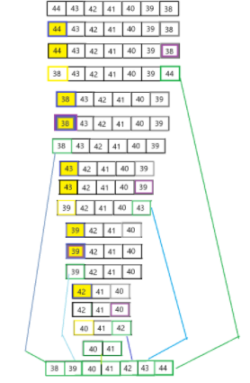
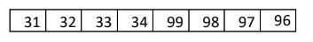
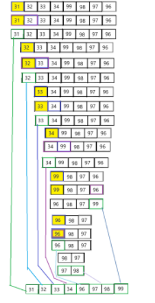

# Ordenar Vetor

1. Considere o seguinte vetor:

Fazer:

a) O teste de mesa para a aplicação de ordenação por Bubble Sort, apresentando quantas rodadas são
necessárias para que o vetor fique ordenado;

b) O teste de mesa para a aplicação de ordenação por Merge Sort, detalhando as divisões e as
operações com os vetores auxiliares;

Bubble Sort

Merge Sort

2. Considere o seguinte vetor:

Fazer:

a) O teste de mesa para a aplicação de ordenação por Bubble Sort, apresentando quantas rodadas são
necessárias para que o vetor fique ordenado;

b) O teste de mesa para a aplicação de ordenação por Merge Sort, detalhando as divisões e as
operações com os vetores auxiliares;

Bubble Sort

Merge Sort 

3. Considere o seguinte vetor: 

Fazer:

a) O teste de mesa para a aplicação de ordenação por Quick Sort, detalhando as divisões e as operações com os vetores auxiliares;

Teste de Mesa

4. Considere o seguinte vetor: 

Fazer:

a) O teste de mesa para a aplicação de ordenação por Quick Sort, detalhando as divisões e as operações com os vetores auxiliares;

Teste de Mesa

5. Considere o seguinte vetor: 

Fazer:

a) O teste de mesa para a aplicação de ordenação por Quick Sort, detalhando as divisões e as operações com os vetores auxiliares;

Teste de Mesa

6. Criar, em Java, uma Biblioteca que implemente as funcionalidades de ordenação do Bubble Sort, Merge Sort e QuickSort.

7. Criar um projeto Java que receba a biblioteca criada no exercício 7 e apresente os resultados dos exercícios 1 à 6

8. Criar um projeto Java que receba as bibliotecas BubbleSort, MergeSort e QuickSort. O projeto deve prever um vetor com 1500 posições ({1499, 1498, 1497, ..., 0}) e apresentar o tempo de ordenação para cada um dos métodos.

- Além da resolução desse exercício, aqui contém códigos respectivamente para ordenação crescente (de menor para maior) e decrescente (de maior para menor) do Bubble Sort, Merge Sort e Quick Sort (e uma biblioteca mais para frente)