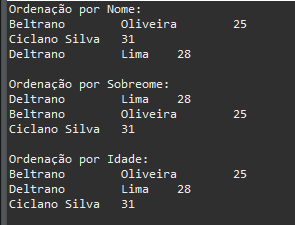

# Ordenando Objetos (Classe Pessoa)

1) Baseado no capítulo "Ordenando objetos" crie mais um atributo para pessoa, esse atributo será sobrenome e naturalmente aplique a técnica de encapsulamento da variável. Altere o método toString() para retornar nome + espaço + sobrenome.

2) Crie um método de ordenação para sobrenome usando Quick Sort;

Códigos e visão original do projeto antes da alteração para as atividades:

Resultados (e algumas alterações/adições):

