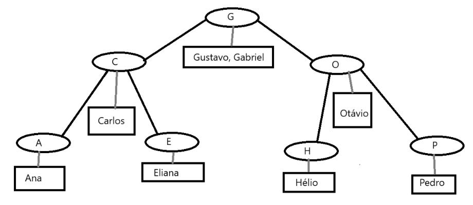

# Extra

- [Ordenacao](./Ordenacao/): Códigos e Exercícios referente a ordenação de vetores e objetos sobre o Bubble Sort, Merge Sort e Quick Sort e testes de mesas

- [Recursividade](./Recursividade/): Atividades e Códigos sobre funções recursivas disponibilizadas pelo material original
  - Cada lista (sendo três no total) contém cerca de 6 exercícios sobre o uso de recursividade e funções recursivas
  - No projeto de Ordenação do subdiretório, contém a tentativa de conversão de ordenações em Recursiva 

- [Fila de Hospital e Triagem](./FilaHospital/): Utilizando a Estrutura de Dados da FIFO (First In First Out ou Primeiro que Entra é o Primeiro que sai), foi feito um projeto que mescla condições de classificações (da triagem e de pacientes preferenciais), do horário atual do local e horário em que o paciente entrou na fila e foi consultado e saiu da unidade
  - Consiste em duas filas (uma preferencial e outra não preferencial) em que cada atributo possível de cada Nó é o nome, prioridade tempo de entrada e atendimento do paciente, além dele ser preferencial ou não
  - A classificação funciona da seguinte forma:

  - Exemplo das filas (Preferencial e não preferencial)

- [Chamada de Métodos](./ChamadaMetodos/): Com o uso de Pilhas (ou Stacks), foi feito algorítmos que demonstram o exemplo interno da própria lógica de chamadas de funções e procedures (seu empilhamento e desempilhamento), além de possível visão de métodos recursivos na execução do código

- Exemplo (linhas pretas são chamadas ou o empilhamento e linhas cinzas o fim da procedure, retorno da função ou desempilhamento da mesma)

- [Listas Encadeadas](./Lista/): Conjunto de Atividades baseadas em 3 Listas (com códigos e testes de mesas), tendo o uso de Listas e estruturas de dados disponibilizados pela lib do Java (java.util) e respectivamente em cada uma delas, o uso exclusivo de cada uma dos tipos de Listas Encadeadas utilizadas no decorrer das aulas de ED (Encadeada Simples, Duplamente Encadeada e Duplamente Circular)

- [Árvore de Nomes](./ArvoreNomes/): Uma árvore binária que mostra nomes de acordo com a ordenação de letras da árvore

- [Grafo para Árvore](./GrafoArvore/): Um projeto que serve de conversão de Grafos (de acordo com a "raiz" especificada e as conexões de elementos possíveis) para uma Árvore não Binária e Árvore não Binária para Grafo

