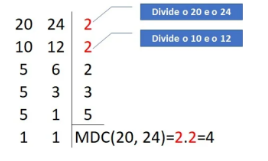
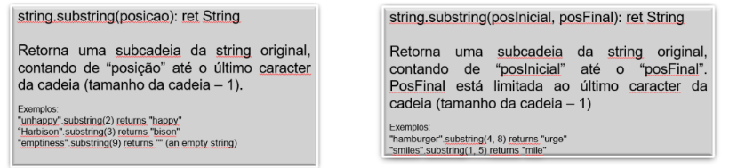
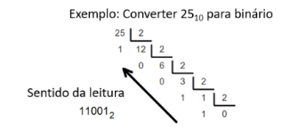
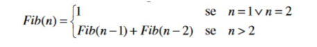
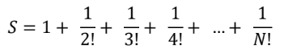

# Recursividade

[Lista 1](./src/lista1/):

1. Criar uma aplicação em Java que tenha uma função recursiva que calcule o somatório do N primeiros
número NATURAIS (a função deve retornar zero para números negativos)

2. Criar uma aplicação em Java que tenha uma função recursiva que, recebendo um vetor de inteiros, o
tamanho do vetor e o valor da última posição do vetor como o primeiro menor valor, retorne o menor valor contido neste vetor.

3. Crie uma função recursiva que exiba o resultado do fatorial de um número (Pela limitação da recursividade, o número de entrada deverá ser baixo para não dar estouro(limite de entrada = 12)):

4. Crie uma função recursiva que exiba o total de elementos negativos de um vetor de inteiros, de N posições, passado como parâmetro:

5. Criar uma aplicação em Java que tenha uma função recursiva que, recebendo um número inteiro (N), apresente a saída da somatória
- SS = 1 + 1/2 + 1/3 + 1/4 + ... + 1/5

[Lista 2](./src/lista2/):

1. Criar uma função recursiva que receba 2 valores A e B e, por somas, apresente o resultado da
multiplicação de A por B.
- Por ex: 7 x 4
  - 7 + 7 + 7 + 7 = 28

2. Criar uma função recursiva que receba o dividendo e o divisor de uma operação de divisão e, por
subtrações, exiba o resto da divisão.
- Mesma lógica da 1 só que com divisão

3. Construir uma função recursiva que receba um vetor e seu tamanho e apresente a quantidade de
números pares existentes no vetor. Considere que a entrada deve ser, apenas de números naturais
diferentes de zero.

4. Faça uma função recursiva que receba um número inteiro positivo ímpar N e retorne o fatorial duplo
desse número (A entrada deve ser validada fora da função recursiva). O fatorial duplo é definido como o
produto de todos os números naturais ímpares de 1 até algum número natural ímpar N. Assim, o fatorial duplo de 5 é:
- !!5 = 1 * 3 * 5 = 15

5. O máximo divisor comum (MDC ou M.D.C) corresponde ao produto dos divisores comuns entre dois ou
mais números inteiros. Para calcular o máximo divisor comum (MDC) entre números, devemos realizar a fatoração por meio da decomposição em fatores primos dos números indicados.
- Para exemplificar, vamos calcular através da fatoração o MDC do 20 e 24:
  - Para saber o MDC dos números, devemos olhar à direita da fatoração e ver quais números dividiram, simultaneamente, nas duas colunas e multiplicá-los.
  - Assim, pela fatoração podemos concluir que o 4 (2 x 2) é o maior número que divide ambos e, portanto, é o máximo divisor comum de 20 e 24.

  - O máximo divisor comum (MDC) de dois números inteiros x e y pode ser calculado usando-se uma
definição recursiva:
    - MDC(x, y) = MDC(x − y, y), se x > y
    - MDC(x,y) = MDC(y,x)
    - MDC(x,x) = x
- Fazer uma função recursiva que receba 2 números inteiros posi vos e apresente o MDC desses números.

[Lista 3](./src/lista3/):

1. Crie uma função recursiva que exiba a quantidade de dígitos de um número inteiro passado como parâmetro
2. Criar uma aplicação em Java que tenha uma função recursiva que, recebendo um número inteiro de 10 a 999999 e recebendo um 2o número inteiro (de 0 a 9), tenha uma função recursiva que apresente quantas vezes o 2o número aparece no primeiro.
- Exemplo1: 1o. Número = 523578; 2o. Número = 5; retorno aparece 2 vezes
- Exemplo2: 1o. Número = 836363; 2o. Número = 3; retorno aparece 3 vezes

- Dica para a resolução do exercício:
  - Exemplo: Número 1234
    - 1234 / 10 = 123 com resto 4
    - 123 / 10 = 12 com resto 3
    - 12 / 10 = 1 com resto 2
    - 1 / 10 = 0 com resto 1
  - Exemplo: Número 8647
    - 8647 / 10 = 864 com resto 7
    - 864 / 10 = 86 com resto 4
    - 86 / 10 = 8 com resto 6
    - 8 / 10 = 0 com resto 8
3. Crie uma função recursiva que exiba o resultado da inversão de uma cadeia de caracteres
(Ex.: entrada = teste ; saída = etset): Deve se utilizar a função SUBSTRING da Java

4. Criar uma aplicação em Java que tenha uma função recursiva que, recebendo um número inteiro,
converta para binário. Entrada limitada a 2000.
- O Código deve apresentar, em formato de comentário, como foi definida a condição de parada;
- O Código deve apresentar, em formato de comentário, como foi definida a relação de chamada
dos passos;

5. Considere a série de Fibonacci:
1, 1, 2, 3, 5, 8, 13, 21, 34, 55, ...
- Escrever uma função recursiva que, dado uma posição da série, a função retorne seu valor. Entrada
limitada a 20.

6. Criar uma aplicação em Java que tenha uma função recursiva que, recebendo um número inteiro (N),
apresente a saída da somatória
- SS = 1 + 1/!2 + 1/!3 + 1/!4 + ... + 1/!5

<b>Nota: todos os exercícios acima das três listas respectivas devem ter os seguintes itens em específico além do uso recursiva: </b>
- <i> O Código deve apresentar, em formato de comentário, como foi definida a condição de parada;</i>
- <i> O Código deve apresentar, em formato de comentário, como foi definida a relação de chamada dos passos;</i>

[Ordenação Recursiva](./src/ordenacao/): Atividade que desenvolvi para treinar a Ordenação de Vetores/Objetos com a Recursividade