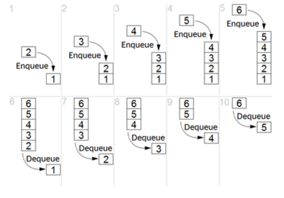
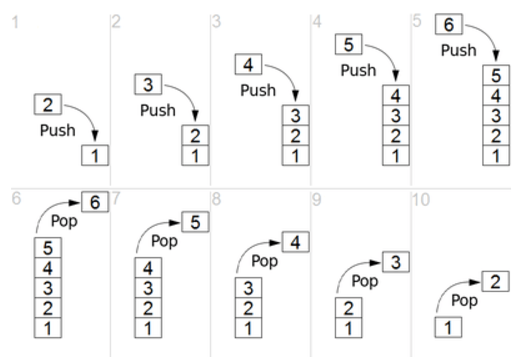

# Fila e Pilha

- [Fila](./src/model/estrutura_fila): Como dito no diretório da disciplina, uma fila é uma FIFO (First In, First Out), uma estrutura de dados de uma lista bem mais restrita, em que um elemento é sempre adicionado da posição do último recente (queue) e o elemento coletado/removido é sempre o primeiro mais recente na fila (enqueue)

- [Pilha](./src/model/estrutura_pilha): Stack/Pilha é uma estrutura, que, como a FIFO, o elemento sempre é adicionado no último mais recente (push). Contudo, um elemento removido é sempre o último mais recente (pop). É possível pensar nela como se fosse a pilha de chamadas de funções/procedimentos (ou o clássico erro do "StackOverflow" ou estouro de pilhas)

