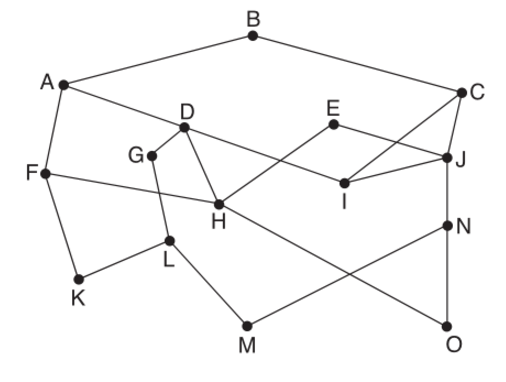
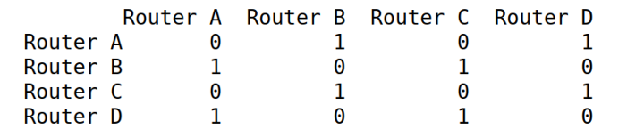
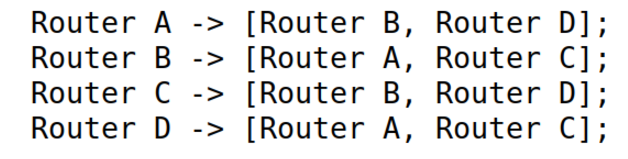

# Grafos

Os grafos proporcionam soluções para inúmeros problemas naturais do ser humano, de seu cotidiano. Resumidamente, pode-se dizer que uma árvore não binária seria um grafo, assim como uma lista também seria sim um grafo, mas com suas particularidades e algumas restrições do próprio formato da estrutura

No geral, eles não tem uma lógica em específica como no exemplo do cronograma, eles podem ter uma, duas, três conexões (ou filhos) com outros elementos e também nada o impede da conexão ser bidirecional (elemento1 tem conexão com o elemento2 e virse-versa) ou unidirecional (elemento1 tem conexão com o elemento2 ou virse-versa)

Existem 2 tipos em específicos de abordagem para Grafos: A Matriz de Adjacência e a Lista de Adjacência (cada um tem seus prós e contras dependendo de para quê que será utilizado)

- [Grafo com Matriz de Adjacência](./MatrizAdjacencia): Uma matriz de adjacência é uma matriz quadrada com dimensões equivalentes ao número de vértices no gráfico. Os elementos da matriz normalmente têm valores 0 ou 1 (grafo comum). Um valor de 1 indica adjacência entre os vértices na linha e coluna e um valor de 0 caso contrário.
  - Essa representação é mais fácil de implementar e eficiente para consultar também. No entanto, menos eficiente em relação ao espaço ocupado 

- [Grafo com Lista de Adjacência](./ListaAdjacencia): Uma lista de adjacências não é nada mais do que uma série de listas. O tamanho da matriz é equivalente ao número de vértices no grafo. A lista em um índice específico da matriz representa os vértices adjacentes do vértice representado por esse índice de matriz.
  -  Esta representação é comparativamente difícil de criar e menos eficiente para consultar. No entanto, oferece melhor eficiência no consumo de memória.
  

