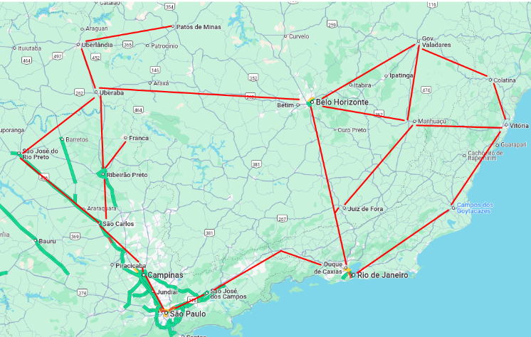
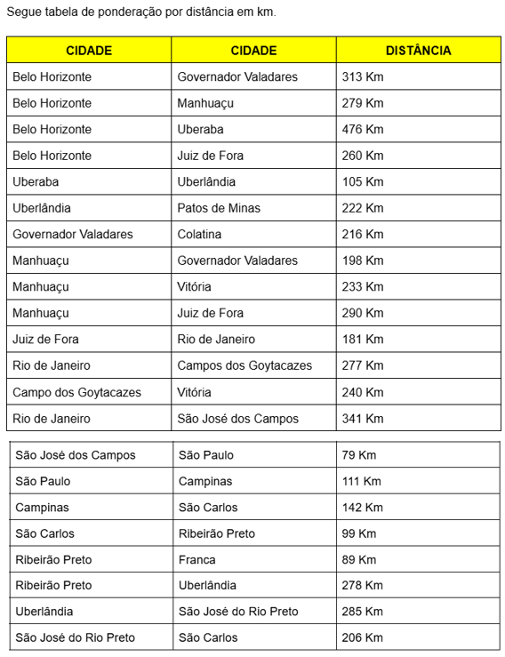
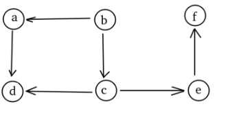

# Estrutura de Dados

- [Recursividade](./Recursividade/): Revisão da lógica de funções e procedimentos recursivos
- [Listas](./listas): Uso da estrutura de dados lista e seus três tipos de modelos (estrutura simples, dupla e duplamente circular)
- [Atividade Lista Dupla Simples](./AtivListaDuplaSimples/): Pequena atividade que faz um Hashtable (acomplamento de duas estruturas), em que existe uma Lista Dupla com uma letra do alfabeto e, que em cada nó existe uma lista simples com nomes de pessoas que se remetem a essa letra em específica da lista dupla
- [Fila e Pilha](./FilaEPilha): Estrutura de dados de FIFO (First In First Out) ou Filha e Stack (Pilha)
- [RoteamentoProtocolos](./RoteamentoProtocolos/): Atividade pós P1 em que se cria uma Hashtable com uma lista circular e uma pilha, em que a dentro da lista existe o tipo de protocolo em específico e uma fila com esses dados do protocolo
- [Arvore Binaria](./Arvore): Estrutura de dados de uma Árvore Binário e um exemplo de uma árvore não binária (esse último feito antes de conhecer Grafos)
- [Grafos](./Grafos): Estrutura de Grafos em formatos de Lista de Adjancência e Matriz de Adjacência
- [Atividade Roteirização](./AtividadeRoteirizacao/): Projeto feito em Matriz de Adjancência de Grafo, em que, segundo o enunciado, "uma fábrica automotiva (peças de reparo para FIAT) se instalou em Belo Horizonte e pretende atender as cidades da tabela abaixo, para estas cidades serão montadas rotas de distribuição e serão atendidas tanto pela fábrica como por dois centros de distribuição, estes centros são usados para atendimento rápido."

 

  - Deve-se montar a árvore de escoamento de produção da empresa para estas cidades, com linhas sempre ativas. O aluno também deve escolher 2 cidades para serem centros logísticos, e montar mais duas árvores baseadas neste centros logísticos (lembre-se que uma cidade não pode ser atendida por dois centros logísticos e nem a cidade que possui a fábrica).
  - Além disso, o programa de computador que será feito perguntará qual a cidade que quer ser atendido por uma entrega, e o sistema deverá responder:
    - Se for pela fábrica:  CIDADE 1, CIDADE 2, CIDADE 3: 00000 KM
    - Se for pelo centro de distribuição próximo: CIDADE 1, CIDADE 2: 00000 KM
- [Escalonamento de Processos](./EscalonamentoProcessos/): Atividade Pós P2 que utiliza um grafo de Matriz de Adjancência e outro de Lista levando em conta a lógica de processos (em que um processo pode ser dependente de outro em um sentido em específico, ou seja, precisa que um seja executado antes para o mesmo seja executado). Assim, tem-se métodos como link a conexão de dependência de um para o outro, desconectar e também ver a sequência em que cada processo que tem recurso ou em que o recurso já foi executado precisa ser percorrido para que não haja um suposto Deadlock

- [Lista para Árvore](./ListaArvore): Existe uma lista de arquivos que precisa ser transformada em árvore, acontece que esta lista está em um array com valores abaixo.
  - /home/usuario/Documents/prova_ed.odt
  - /home/usuario/Documents/hino_BOTAFOGO.mp3
  - /home/usuario/Documents/prova_ihc.odt
  - /home/usuario/Documents/prova_ed_mais_top.odt
  - /home/usuario/Images/AlunosFelizes.png
  - /home/usuario/Images/CachorroCaramelo.png
  - /home/usuario/Downloads/Debian12.8.img
    - Seu trabalho é fazer um código em Java que recebe um array com valores semelhantes a esta lista (acima) e transforma em árvore.

