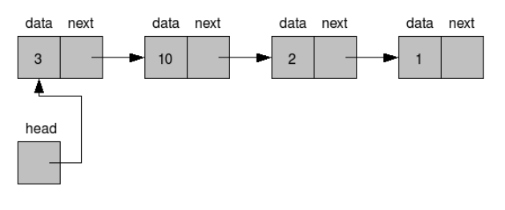
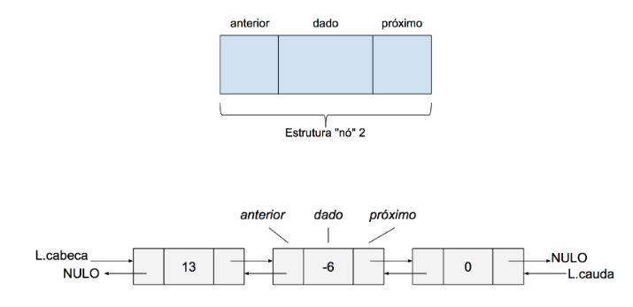
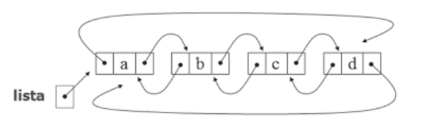

# Listas

- [Lista Encadeada Simples](./src/model/estrutura_simples/): É uma estrutura em que, para um Nó se conectar com um outro, existe uma propriedade que é como se fosse um ponteiro que indica o elemento seguinte à ele (o próximo elemento dele) e assim por diante. Contém ações como append (adicionar elemento na última posição da lista), get (coletar índice e ponteiro do elemento pelo nome), index (coletar ponteiro do elemento pelo índice), insert (inserir elemento em determinada posição), last (último elemento da lista), remove (remover elemento) e total (quantidade de elementos na lista)

- [Lista Duplamente Encadeada](./src/model/estrutura_dupla/): É uma estrutura em que, para um Nó se conectar com um outro, existe uma propriedade que é como se fosse um ponteiro que indica o elemento seguinte e posterior à ele (o próximo elemento dele e anterior à ele) e assim por diante. Contém ações como append (adicionar elemento na última posição da lista), get (coletar índice e ponteiro do elemento pelo nome), insert (inserir elemento em determinada posição), last (último elemento da lista), prepend (adicionar o elemento na primeira posição da lista), remove (remover elemento) e total (quantidade de elementos na lista)

- [Lista Circular Duplamente Encadeada](./src/model/estrutura_circular/): Uma estrutura que é uma lista dupla. Contudo, ao invés do ponteiro do último ou primeiro elemento (seja anterior o próximo) ser nulo, o anterior do primeiro elemento se conecta com o último e virse-versa (criando a lista como se fosse círculo)

- <b> Lembrando que todos os arquivos de models (seja nó ou estrutura) dessas estruturas ou de qualquer outra estrutura mais para frente tem um toString para converter o valor em algo possível de ser imprimido ou percorrer todos os valores de elementos da estrutura de dados </b>