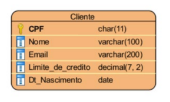

# Laboratório de Banco de Dados

- [Revisão Banco de Dados](./SQLServer/): Exercício de revisão da disciplina de Banco de Dados, para relembrar todos os conceitos adquiridos para utilizá-los nessa continuação da disciplina em LabBD (DDL e DML)

- [SQLServer](./SQLServer/): Exercícios e atividades no âmbito de SQL, utilizando o SQLServer como base (UNIONS, VIEWS, Stored Procedures (SP) e User Definided Functions (USF) com ou sem retornos de dados e/ou tabelas, Tabelas Dinâmicas, Triggers e Cursores)

- [JavaWebMaven](./JavaWebMaven/): Primeiro desenvolvimento em aula do uso do Java Web Maven puro no contexto de uma Entidade Pessoa. Possuí o uso dos padrões comuns Web do Maven, como Servlets, JSPs, WebApps, Lombok e Jakarta e o uso de DAOs em um formato semelhante ou próximo ao trabalho de Banco de Dados

Enunciado
1) Para fazer um cadastro de cliente, conforme diagrama abaixo, o CPF deve ser válido.
Criar uma procedure que permita fazer o insert, update e delete de um cliente garantindo que:
  - Para insert, o CPF deve ser válido e não pode ser 11 números repetidos (11111111111,
22222222222, etc)
  - Para update, não se pode alterar o CPF
  - Atomizar a stored procedure principal chamando outras procedures para facilitar o
entendimento e a manutenção;
  - Preencher a tabela com dados para testes e usar o https://www.4devs.com.br/gerador_de_cpf
para gerar CPF válidos com finalidade de teste.
  - Criar, em Spring MVC, uma solução Java Web que permita fazer o CRUD de cliente, utilizando as
chamadas de procedures para tratar as regras de negócio ao invés de usar os PreparedStatements para
Insert, Update e Delete.

- [Lista de Carros](./ListaCarros/): Segunda atividade desenvolvimento no uso do Java Web Maven puro, dessa vez no contexto da Entidade Carros e como uma lição de casa
  - Baseado no material de Exemplos, criar um CRUD para o objeto definido abaixo (Usar Maven e
Lombok):

- [Avaliação 1](https://github.com/GustavoPereira-Dev/AV1-LabBD-Banco): Primeira atividade avaliativa da disciplina em um contexto mais amplo que os anteriores (de Instituições Bancárias) e usando o Java Web Maven Puro

- [Cadastro Cliente](./CadastroClienteSpring/): Primeiro uso do Spring Boot com Spring Web

- [Projetos em Spring](./ProjetosSpring/): Projetos desenvolvidos após o de Java Web Maven puro, dessa vez utilizando o Framework do Java denominado Spring Boot com vários outros módulos, como, especialmente, o Spring Web, Spring Data e dentre outros usando Procedures

- [Avaliação 2](https://github.com/GustavoPereira-Dev/AV2-LabBD-Faculdade): Segunda atividade avaliativa agora utilizando o Spring Web e Data (Hibernate) no contexto de inscrições de vagas na unidade (Óraculo) usando Procedures, Functions e Triggers

- [Relatorios](./Relatorios/): Geração de Relatórios em PDFs utilizando o JasperSoft Studio

- [MongoDB](./MongoDB/): Uso básico e geral do MongoDB, um Banco de Dados não-relacional (NoSQL)

- [Avaliação 3](https://github.com/GustavoPereira-Dev/AV3-LabBD-Delivery): Última atividade avaliativa utilizando todos os conhecimentos adquiridos anteriormente (Spring Web, Data e conceitos de avaliações anteriores), Cursores e a Geração de Relatórios

<b>Nota: Todas as avaliações da disciplina foram desenvolvidas por mim (projeto em Java) e pelo [@Joaoftito](https://github.com/Joaoftito) (SQL, Diagramação e Relatórios)</b>