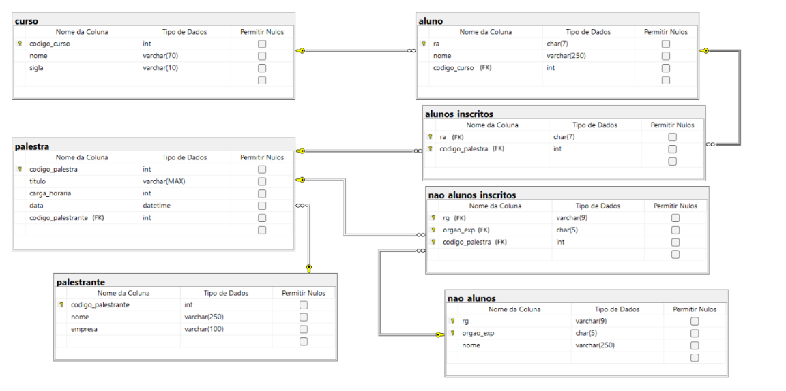

# Union e View

Considerando o diagrama abaixo, criar, em SQL Server, a database e gerar dados para preencher as
tabelas:

O domínio trata de palestras em uma Faculdade. Palestrantes apresentarão palestras para alunos e não alunos. Para o caso de alunos, seus dados já são referenciáveis em outro sistema, portanto, basta saber seu RA, no entanto, para não alunos, para prover certificados, é importante saber seu RG e Órgão Expedidor. O problema está no momento de gerar a lista de presença. A lista de presença deverá vir de uma consulta que retorna (Num_Documento, Nome_Pessoa, Titulo_Palestra, Nome_Palestrante, Carga_Horária, Data(dd/mm/aaaa) e Hora (HH:mm)). A lista deverá ser uma só, por palestra (A condição da consulta é o código da palestra) e contemplar alunos e não alunos (O Num_Documento se referencia ao RA para alunos e RG + Orgao_Exp para não alunos) e estar ordenada pelo Nome_Pessoa. Fazer uma view de select que forneça a saída solicitada