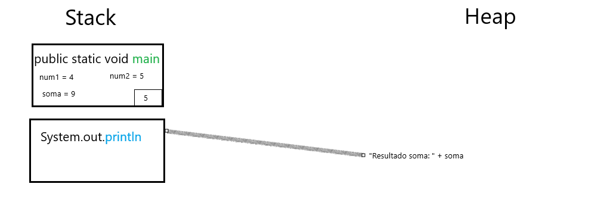

# Aula 1

[1)](./Exercicio1) Faça um programa que solicite ao usuário para digitar dois números que serão guardados em variáveis do tipo double, e em seguida o programa deve mostrar a soma destas variáveis na tela.
Assumindo que a primeira linha é aquela linha executada em primeiro na função public static void main, faça um desenho da memória Stack e Heap no momento em que o código estiver executando a 5ª linha.

[2)](./Exercicio2) Faça um código em Java para estourar a memória Stack. Você saberá que o programa foi bem sucedido quando ocorrer um erro de StackOverflow

[3)](./Exercicio3) Faça um código em Java para estourar a memória Heap. Você saberá que o programa foi bem sucedido quando ocorrer um erro de Out of Memory - Java Heap Error, ou algo parecido.

[4)](./Exercicio4) Crie e inicie variáveis para guardar as informações abaixo usando os tipos de variáveis de acordo com a forma que achar correto. 
- Nome da empresa com no máximo 25 caracteres. 
- Total de salários pagos no mês, em uma grande empresa 
- Quantidade de dias de faturamento, normalmente esta informação será fixa e nunca mais alterada 
- Todas as notas de um aluno de uma disciplina 
- Todos os dados de um carro (placa, chassi, modelo, ano, cor, nome do dono) que foi multado. 
- O número de ouro da matemática valor 1.61803... 
- Os nomes dos alunos de uma turma com 10 alunos 
- Quantidade de pares de tênis de um armário 

[5)](./Exercicio5) A partir de objetos comuns, crie 3 classes, abstraindo ao menos 5 características e 3 comportamentos para cada uma.
Crie o código em Java para estas classes

[6)](./Exercicio6) A partir de objetos comuns, crie 3 classes, abstraindo ao menos 5 características e 3 comportamentos para cada uma.

Crie o código em Java para estas classes

Com base nas classes criadas no exercício anterior, instancie 2 objetos para cada classe, e escreva códigos para modificar suas características e executar seus comportamentos.
