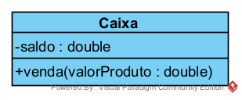

# Aula 4

- [7)](./Caixa/): Crie uma classe chamada Caixa que faça venda de produtos, conforme o layout em anexo. A função da venda deverá acrescer o valor do produto no saldo, e deverá retornar o valor do novo saldo
  - Faça também uma classe para testes que instancie o objeto Caixa e invoque a função venda.

- [8)](./CaixaVarargs/): Com base no exercício anterior o seu cliente pediu para que as vendas possam receber diversos produtos simultaneamente.
  - Faça a modificação no método venda de maneira que possa somar os valores de diversos produtos de uma única vez.
  

- [9)](./ComposicaoAgregacacao/): Identifique 3 classes do mundo real, de forma que cada uma delas possuam ao menos duas relações de associação sendo uma de agregação e outra de composição.
  - Desenhe um diagrama com as classes e suas relações
  - Faça o código Java com estas classes, crie ao menos 2 construtores em cada classe, um deles recebendo parâmetros para preencher todos os atributos, e outro construtor não recebendo parâmetro algum.
  - Faça uma classe Teste que instancie as classes principais e as que servem como agregação, e faça o vínculo entre elas, o vínculo pode ser feito por meio dos construtores das classes principais.

- [TesteApp (Gradle)](./testeapp/): Teste do uso da execução do Gradle