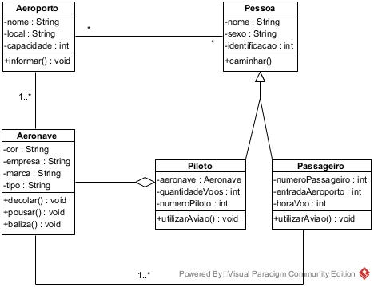

# Aula 5

- 10) Criar exercício de dependência sobre Aeroporto, fazendo os relacionamentos que julgar necessário com as entidades abaixo:
  - Aeronave
  - Pessoa
  - Piloto
  - Passageiro
  - Aeroporto

  1. Desenhe o diagrama de classe dessas entidades, especificando as associações entre elas. Cada classe deve conter pelo menos 3 características e ao menos 1 comportamento, não se esqueça de fazer também a herança.
  2. Escreva o código em Java das classes
  3. Crie uma função main que instancie ao menos 2 instâncias de cada classe, preenchendo as associações.

  