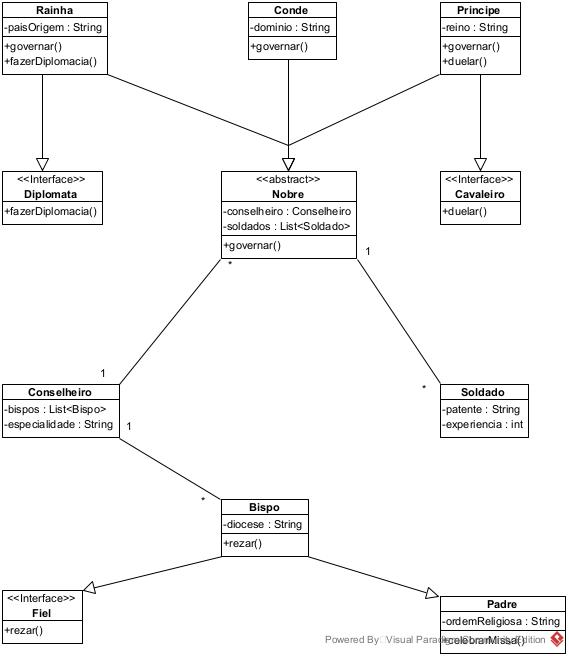

# Aula 7 (Interfaces)

[Interfaces Nobreza](./edu/nobreza/)
- Com base no texto:
  - No reino Fedora, há um Principe e um Conde que disputam pelo poder, ambos são do tipo Nobre e dessa forma herdam o comportamento governar(), porém o Principe além de Nobre ele também se comporta como um Cavaleiro. Todo o Cavaleiro sabe duelar(). A Rainha também é Nobre porém além disso ela sabe fazerDiplomacia() que é a arte do Diplomata.
  - Todo o Nobre possui um Conselheiro, e um conjunto de Soldado, o Conselheiro possui vários Bispo a sua disposição e por sua vez o Bispo herda de Padre e implementa Fiel, onde todo o Fiel sabe rezar().

  - P.S. Para a sua sanidade, assuma que apenas as classes podem agregar outras classes ou interfaces.
  - Crie:
    - Uma lista com os tipos existentes no texto, informando se são classes ou interfaces.
    - Diagrama de classe UML mostrando as relações entre os tipos detectados. Assuma que todas as relações de associação serão representadas por agregações. Não precisa implementar os métodos get e set dessas agregações, basta torná-las package ou públicas.
    - Código Java de todos os tipos em um mesmo pacote chamado edu.nobreza

