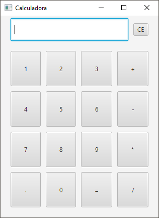

# Aula 8

- [14)GestaoFuncionarios](./GestaoFuncionarios/): Crie um sistema para gestão de Funcionários
  - O sistema deverá permitir a Criação, Atualização, Remoção e Exibição do(s) Funcionario(s).

- [15 e 16) - GestaoFuncionarios](./Contatos/): Crie uma aplicação para mostrar uma agenda de contatos, semelhante a esta em anexo. Neste exercício preocupe-se apenas em criar a tela não se preocupe com as funcionalidades dos botões. Utilize alguns Paineis especiais como BorderPane, FlowPane, GridPane ou outro que desejar para tornar a tela responsiva.

- [17)JanelaCalculadora](./Calculadora/): Crie uma aplicação para mostrar uma calculadora, semelhante a esta em anexo. Neste exercício preocupe-se apenas em criar a tela com o display e os botões, a calculadora não precisa funcionar, os botões não precisam executar nenhuma atividade.

