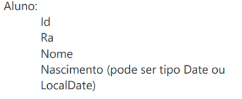
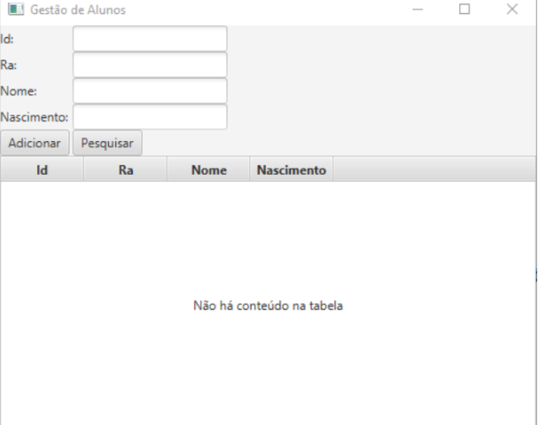
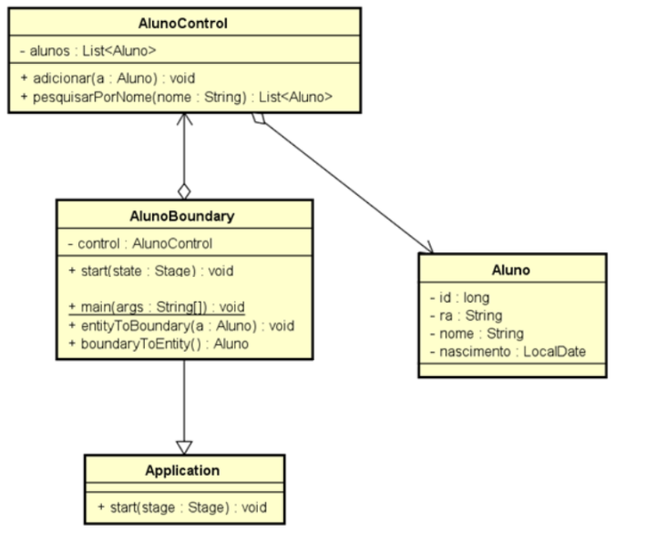

# Atividades com JavaFX

## Curso

- Crie um CRUD para fazer a manutenção de cursos, contendo o Boundary, o Control e a Entidade (BCE), contendo um botão para adicionar novo curso e outro para pesquisar, conforme layout abaixo:

  - Curso:
    - Id        
    - Nome
    - Código do Curso
    - Nome do Coordenador
    - Quantidade de alunos
  - Faça com que o Control guarde a lista de cursos e tenha uma função para gravar novos cursos [ public void gravar(Contato c) ] e outra função para pesquisar [ public Contato pesquisar( String parteNome ) ] para localizar um curso pelo nome
  - Faça com que o Boundary tenha uma instância de Control e acione os métodos gravar e pesquisar desta instância conforme os botões gravar e pesquisar são acionados.
  - Dentro do Boundary crie uma função [ public Curso toEntity() ] que irá gerar e retornar um objeto do tipo Curso com os dados que estiverem na tela. Crie também uma função chamada [ public void fromEntity(Curso c) ] que deverá pegar os dados do objeto do tipo Curso informado no parâmetro colocando-os na tela.

## Aluno

- Crie um CRUD para fazer a manutenção de alunos, contendo o Boundary, o Control e a Entidade (BCE - Simplificado)

Para isto:

1. Crie a classe da Entidade com os atributos todos como privados, e os respectivos gets e sets

2. Crie a classe Control contendo um ArrayList do tipo da Entidade, anotando os métodos abaixo:

a. void adicionar(<Entidade> e), deve adicionar o objeto do tipo Entidade recebido como parâmetro no ArrayList

b. <Entidade> pesquisar PorNome (String nome), deve pesquisar no ArrayList para localizar se há um objeto do tipo da Entidade com o campo Nome contendo o texto que foi recebido como parâmetro, em caso positivo deve retornar o objeto encontrado. Caso não encontre nenhum objeto, deve retornar null.

3. Crie a classe Boundary conforme o diagrama de classe:

a. Declare os componentes gráficos necessários conforme o layout abaixo, como sendo variáveis ​​de instância, lembre-se de que você não precisa declarar os componentes do tipo Label, desde que eles sejam criados diretamente quando forem aviso no GridPane

b. Escreva o código do método start() para que ele crie um objeto do tipo GridPane e posicione os componentes gráficos conforme o layout abaixo.

c. Escreva o código do método <Entidade> boundary ToEntity() para que ele gere um novo objeto do tipo Entidade e preencha suas propriedades com as informações provenientes dos TextFields

d. Escreva o código do método entityToBoundary (<Entidade> e) para que ele leia as propriedades do objeto do tipo Entidade recebidas como parâmetro e preencha os TextFields com estas informações.

e. Dentro da função start(), registre uma função lambda/arrow no botão Adicionar para executar a função adicionar() do Control quando este botão for acionado, e uma função lambda/arrow no botão Pesquisar para executar a função pesquisar() do Control quando este botão for acionado
