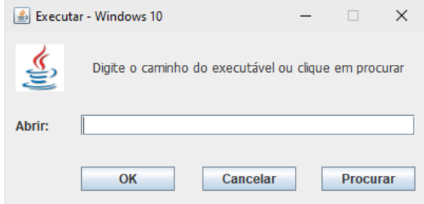
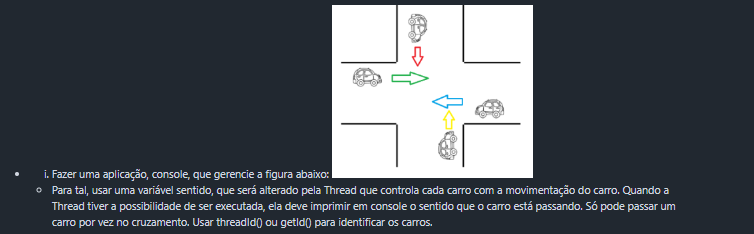

# Exercícios Extras

São alguns exercícios especialmente com uso de Interfaces gráficas do Java (Java Swing/JavaFX) para treinar um pouco o uso disso na disciplina do próximo Semestre (Programação Orientada a Objetos) que irá utilizar isso

Somente o de Processos é exclusivo, os ademais são conversões da linha de código (de alguns exercícios de Threads e Semáforos) para Interface Gráfica

## Processos
[Executar Windows](./Processos)
- Utilizando o Framework Window Builder, criar, em Eclipse, um projeto Java que simula o Executar (Run) do Windows.
- No package view, deve ser criado, com auxílio do framework, conforme figura abaixo, uma tela com um JTextField e 3 botões (OK, Cancelar e Procurar).
- No package controller, devemos ter:
  - 1) Uma classe, chamada SearchController, que receba o JTextField pelo construtor, implementa um ActionListener para executar a ação do botão Procurar. No método ActionPerformed, deve ter uma busca de arquivos executáveis Windows, via JFileChooser, e seleciona o arquivo a ser executado e escreve seu caminho completo no JTextField.
  - 2) Uma classe, chamada RunController, que receba o JTextField e o próprio JFrame da tela pelo construtor, implementa um ActionListener para executar a ação do botão OK. No método ActionPerformed, deve tentar executar o que está escrito no JTextField (O usuário pode digitar o caminho por conta própria, ao invés de procurar). Caso o arquivo seja inválido, dar uma mensagem de erro. Uma vez executado, sem erro, a tela deverá ser finalizada
pelo método dispose().
  - 3) Uma classe, chamada CancelController, que receba o próprio JFrame da tela pelo construtor, implementa um ActionListener para executar a ação do botão Cancelar. O método actionPerformed deve proceder um dispose() da tela.

## Threads e Semáforos (Conversão para as telas de GUI)

- [Corrida dos Sapos](./CorridaSapos)
  - Fazer uma aplicação de uma corrida de sapos, com 5 Threads, cada Thread controlando 1 sapo. Deve haver um tamanho máximo para cada pulo do sapo (em metros) e a distância máxima para que os sapos percorram. A cada salto, um sapo pode dar um salto de 0 até o tamanho máximo do salto (valor aleatório). Após dar um salto, a Thread, para cada sapo, deve mostrar no console, qual foi o tamanho do salto e quanto o sapo percorreu. Assim que o sapo percorrer a distância máxima, a Thread deve apresentar que o sapo chegou e qual sua colocação.
- [Overcooked Java](./OvercookedJava)
  - Existem diversos jogos de simulação. Um deles simula a participação de cozinheiros em uma cozinha profissional realizando pratos. Numa das fases, o cozinheiro precisa realizar o cozimento de 5 pratos simultâneos, onde cada cozimento não depende da interação do jogador. Pratos de ID ímpar, são chamados de Sopa de Cebola e levam de 0,5 a 0,8 segundos para ficar prontos. Pratos de ID par, são chamados de Lasanha a Bolonhesa e levam de 0,6 a 1,2 segundos para ficar prontos. Quando um prato inicia, é necessário comunicar, em console, que se iniciou e, a cada 0,1 segundos, deve-se exibir o percentual de cozimento (O percentual é definido pelo tempo total dividido por 0,1 segundos). Quando um prato fica pronto, é necessário comunicar em console o final e fazer a entrega, que leva 0,5 segundos. O jogador só pode entregar um prato por vez e deve comunicar a entrega. Simular a situação em Java.
- [Cavaleiros](./Cavaleiros)
  - Simular em Java: 4 cavaleiros caminham por um corredor, simultaneamente, de 2 a 4 m por 50 ms. O corredor é escuro, tem 2 km e em 500 m, há uma única tocha. O cavaleiro que pegar a tocha, aumenta sua velocidade, somando mais 2 m por 50 ms ao valor que já fazia. Em 1,5 km, existe uma pedra brilhante. O cavaleiro que pegar a pedra, aumenta sua velocidade, somando mais 2 m por 50 ms ao valor que já fazia (O cavaleiro que já detém a tocha não poderá pegar a pedra). Ao final dos 2 km, os cavaleiros se deparam com 4 portas e, um por vez pega uma porta aleatória (que não pode repetir) e entra nela. Apenas uma porta leva à saída. As outras 3 tem monstros que os devoram.
- [Aeroporto](./Aeroporto)
  - Um aeroporto tem 2 pistas (norte e sul) e, em cada pista, apenas um avião pode fazer a decolagem.
    - O procedimento de decolagem tem 4 fases (taxiar, decolagem e afastamento da área). A fase de manobra pode durar de 300 a 700 milissegundos A fase de taxiar, de 500 a 1000 milissegundos. A fase de decolagem, de 600 a 800 milissegundos.
    - A fase de afastamento, de 300 a 800 milissegundos. O aeroporto reúne, por ciclo, 12 aeronaves que podem decolar pela pista norte ou pela pista sul (decisão aleatória) mas, apenas 2 aviões podem circular pela área de decolagem ao mesmo tempo. Fazer uma aplicação em Java que resolva o problema.

- [Triatlo](./Triatlo)
  - Numa prova de triatlo moderno, o circuito se dá da seguinte maneira:
    - 3Km de corrida onde os atletas correm entre 20 e 25 m/30 ms
    - 3 tiros ao alvo com pontuação de 0 a 10
    - 5 km de ciclismo onde os atletas pedalam entre 30 e 40 m/40 ms
  - 25 atletas participam da prova e largam juntos, no entanto, apenas 5 armas de tiro estão a disposição. Cada atleta leva de 0,5 a 3s por tiro.  
  - Conforme os atletas finalizam o circuito de corrida, em ordem de chegada, pegam a arma para fazer os disparos. Uma vez encerrados os disparos, a arma é liberada para o próximo, e o atleta segue para pegar a bicicleta e continuar o circuito. Para determinar o ranking final dos atletas, considera-se a seguinte regra:
    - O primeiro que chegar recebe 250 pontos, o segundo recebe 240, o terceiro recebe 230,..., o último recebe 10.
    - Soma-se à pontuação de cada atleta, o total de pontos obtidos nos 3 tiros (somados)
    - Ordenar a pontuação e exibir o resultado final do maior pontuador para o menor.
- [Cruzamento](./Cruzamento)

- [Corredores](./Corredor)
  - Quatro pessoas caminham, cada uma em um corredor diferente. Os 4 corredores terminam em uma única porta. Apenas 1 pessoa pode cruzar a porta, por vez. Considere que cada corredor tem 200m. e cada pessoa anda de 4 a 6 m/s. Cada pessoa leva de 1 a 2 segundos para abrir e cruzar a porta. Faça uma aplicação em java que simule essa situação.
- [Fórmula 1](./Formula1)
  - Você foi contratado para automatizar um treino de Fórmula 1. As regras estabelecidas pela direção da provas são simples: “No máximo 5 carros das 7 escuderias[equipe] (Cada escuderia tem 2 carros diferentes, portanto, 14 carros no total) presentes podem entrar na pista simultaneamente, mas apenas um carro de cada equipe. O segundo carro deve ficar à espera, caso um companheiro de equipe já esteja na pista. Cada piloto deve dar 3 voltas na pista. O tempo de cada volta deverá ser exibido e a volta mais rápida de cada piloto deve ser armazenada para, ao final, exibir o grid de largada, ordenado do menor tempo para o maior.”
