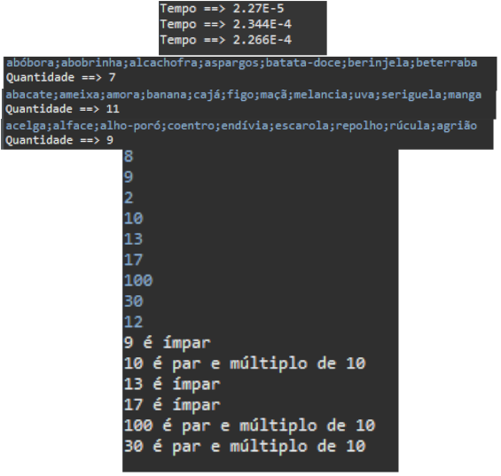

# Exercícios
<ol>
  <li>Fazer uma aplicação Java em Eclipse que tenha uma operação que receba um vetor de 1000
posições inteiras (Preencher todas as posições com valor 0) e gere o tempo gasto, em
Segundos, para percorrer o vetor. Repetir para 10000 e 100000 posições. A aplicação deve
ter uma classe de controle com métodos para operações e uma classe de visão que instancie
a classe de controle para a comunicação. A resposta da tarefa deve ser o print do console
com cada tempo. </li>
 <li>Fazer uma aplicação Java em Eclipse que tenha uma operação que se permita entrar com um
texto, conforme exemplo abaixo, por Scanner ou JOptionPane, divida o texto em partes, com
split e exiba quantas partes aquele texto tem. A aplicação deve ter uma classe de controle
com métodos para operações e uma classe de visão que instancie a classe de controle para
a comunicação, A resposta da tarefa deve ser o print do console com as quantidades.
  <ul>
    <li>Texto 1: abóbora;abobrinha;alcachofra;aspargos;batata-doce;berinjela;beterraba</li>
    <li>Texto 2: abacate;ameixa;amora;banana;cajá;figo;maçã;melancia;uva;seriguela;manga</li>
    <li>Texto 3: acelga;alface;alho-poró;coentro;endívia;escarola;repolho;rúcula;agrião</li>
  </ul>
  </li>
  <li>Fazer uma aplicação Java em Eclipse, que permita ao usuário, por Scanner ou JOptionPane,
entrar o tamanho (n) de um vetor de inteiros (limite a entrada a 100) e entrar com os n
valores. Deve-se fazer uma classe de controle que tenha uma operação que receba o vetor
como parâmetro, percorra o vetor utilizando for each e, caso o número seja ímpar, exiba o
número e a indicação que é ímpar e, caso seja par, exiba apenas os múltiplos de 10, e a
indicação de que são pares e múltiplos de 10. A resposta deve ser um print do console com
um vetor de entrada de 8 posições.</li>

</ol>

Imagens de input/output do código

