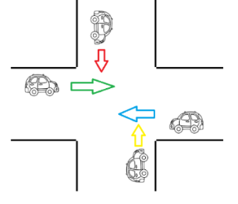

# Projeto Semáforos - parte 2

- 1. Fazer uma aplicação, console, que gerencie a figura abaixo:

  - Para tal, usar uma variável sentido, que será alterado pela Thread que controla cada carro com a movimentação do carro. Quando a Thread tiver a possibilidade de ser executada, ela deve imprimir em console o sentido que o carro está passando. Só pode passar um carro por vez no cruzamento. Usar threadId() ou getId() para identificar os carros.

- 2. Quatro pessoas caminham, cada uma em um corredor diferente. Os 4 corredores terminam
em uma única porta. Apenas 1 pessoa pode cruzar a porta, por vez. Considere que cada corredor tem 200m. e cada pessoa anda de 4 a 6 m/s. Cada pessoa leva de 1 a 2 segundos
para abrir e cruzar a porta. Faça uma aplicação em java que simule essa situação.
- 3. Um banco deve controlar Saques e Depósitos.
  - O sistema pode permitir um Saque e um Depósito Simultâneos, mas nunca 2 Saques ou 2
Depósitos Simultâneos. Para calcular a transação (Saque ou Depósito), o método deve
receber o código da conta, o saldo da conta e o valor a ser transacionado. Deve-se montar
um sistema que considera 20 transações simultâneas enviadas ao sistema (aleatoriamente,
essas transações podem ser qualquer uma das opções) e tratar todas as transações. Como
são transações aleatórias, podem ser 20 saques e 0 depósitos ou 19 saques e 1 depósito ou
18 saques e 2 depósitos ou .... ou 1 saque e 19 depósitos ou 0 saque e 20 depósitos.
- 4. Você foi contratado para automatizar um treino de Fórmula 1. As regras estabelecidas pela direção da provas são simples: “No máximo 5 carros das 7 escuderias[equipe] (Cada escuderia tem 2 carros diferentes, portanto, 14 carros no total) presentes podem entrar na pista simultaneamente, mas apenas um carro de cada equipe. O segundo carro deve ficar à espera, caso um companheiro de equipe já esteja na pista. Cada piloto deve dar 3 voltas na pista. O tempo de cada volta deverá ser exibido e a volta mais rápida de cada piloto deve ser armazenada para, ao final, exibir o grid de largada, ordenado do menor tempo para o maior.”