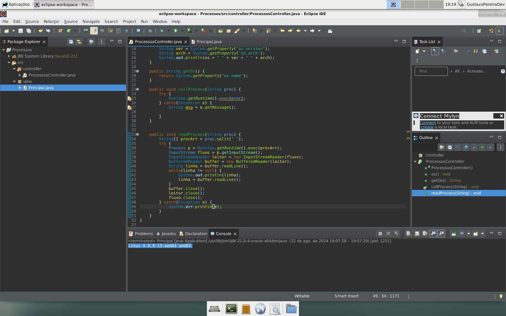

# Processos
## EXERCÍCIO 1
- Criar em Eclipse, um novo Java Project com uma classe chamada RedesController.java no
package controller e uma classe Main.java no package view.
- A classe RedesController.java deve ter 3 métodos.
  - 1) O primeiro, chamado os, que identifica e retorna o nome do Sistema Operacional (Fazê-lo
privado)
  - 2) O segundo, chamado ip, que verifica o Sistema Operacional e, de acordo com o S.O., faz a
chamada de configuração de IP.
    - A leitura do processo chamado deve verificar cada linha e, imprimir, apenas, o nome do
adaptador de rede e o IPv4, portanto, adaptadores sem IPv4 não devem ser mostrados
  - 3) O terceiro, chamado ping, que verifica o Sistema Operacional e, de acordo com o S.O. e, faz a
chamada de ping em IPv4 com 10 iterações.
    - A leitura do processo chamado deve verificar as linhas de saída e exibir, apenas, o tempo médio
do ping. O teste de ping deve ser feito com a URL www.google.com.br
- A Classe Main.java deve dar as opções de chamadas do método ip ou do método ping com
JOptionPane e, dependendo da escolha, instanciar a Classe RedesController.java e chamar o
método escolhido. A opção de finalizar a aplicação também deve estar disponível.

## EXERCÍCIO 2

- Fazer, em java, uma aplicação que liste os processos ativos, permita ao usuário entrar com o
nome ou o PID do processo e o mate.
- A aplicação deverá funcionar, minimamente em Windows e Linux.

- A classe KillController.java deve ter 4 métodos.
  - 1) O primeiro, chamado os, que identifica e retorna o nome do Sistema Operacional (Fazê-lo
privado)
  - 2) O segundo, chamado listaProcessos, que verifica o SO e, de acordo com SO, selecione o
comando para listar os processos ativos.
O método deve receber todas as linhas de saída do processo de listagem e exibi-las em console
  - 3) O terceiro, chamado mataPid, que recebe um PID como parâmetro de entrada, verifica o SO
e, de acordo com SO, selecione o comando para matar o processo e o finalize
  - 4) O quarto, chamado mataNome, que recebe um nome de processo como parâmetro de
entrada, verifica o SO e, de acordo com SO, selecione o comando para matar o processo e o
finalize

## EXERCÍCIO 3 – Exclusivo Linux
- No universo do Sistema operacional Linux existem diversas distribuições. Os comandos Java
System.getProperty(“os.name”) e System.getProperty(“os.version”) trazem dados sobre o
Kernel Linux, mas não sobre a distribuição.
- A classe DistroController.java deve ter 2 métodos.
  - 1) O primeiro, chamado os, que identifica e retorna o nome do Sistema Operacional (Fazê-lo
privado)
  - 2) O segundo, chamado exibeDistro, que verifica o SO e, se for Linux, selecione o comando para
exibir as propriedades da distribuição. Deve-se exibir o nome e a versão da distribuição. Caso o
SO não seja Linux, exibir uma mensagem comunicando.

