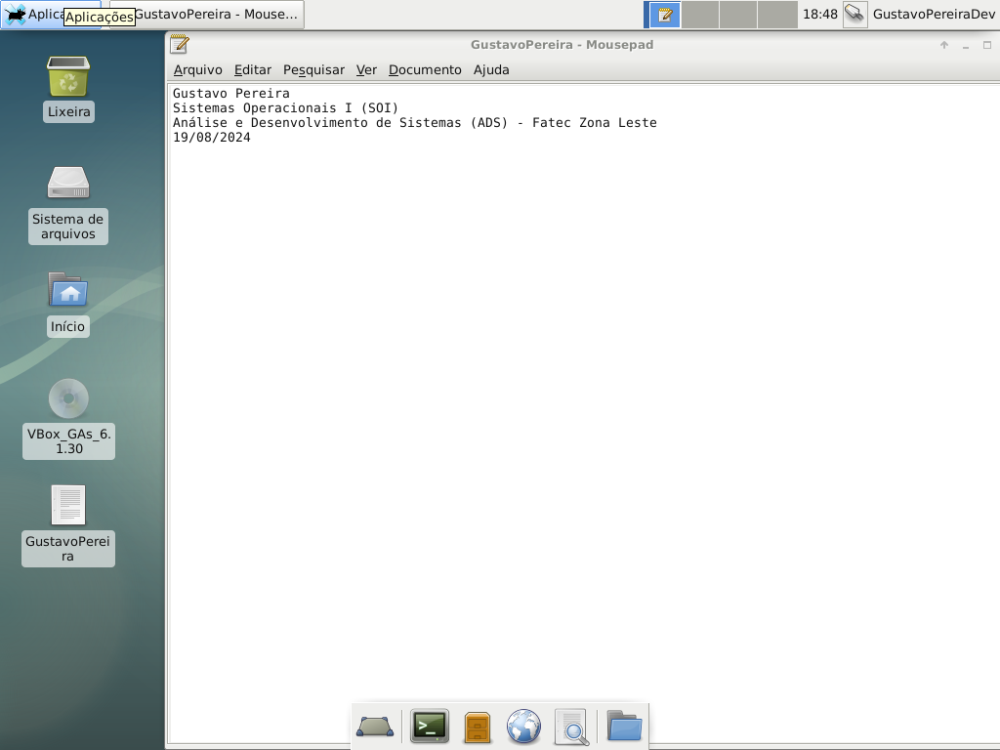

# Segunda Aula (Linux)

- Essa atividade feita conta com a utilização de máquina virtual (Virtual Machine) para utilizar e fazer a introdução de utilizar o Linux Debian (9) pela VM da Oracle 
- Contou com a configuração inicial do Sistema Operacional e algumas outras coisas após ter sido concluído a entrada de tela padrão do SO
- Abaixo é possível ver um dos requisitos para concluir a atividade, que era após de finalizar a criação do Debian 9, utilizar o "Notepad do Linux" (MousePad) para escrever dados específicos da disciplina e etc. e fazer uma captura de tela na própria máquina virtual desse Linux

